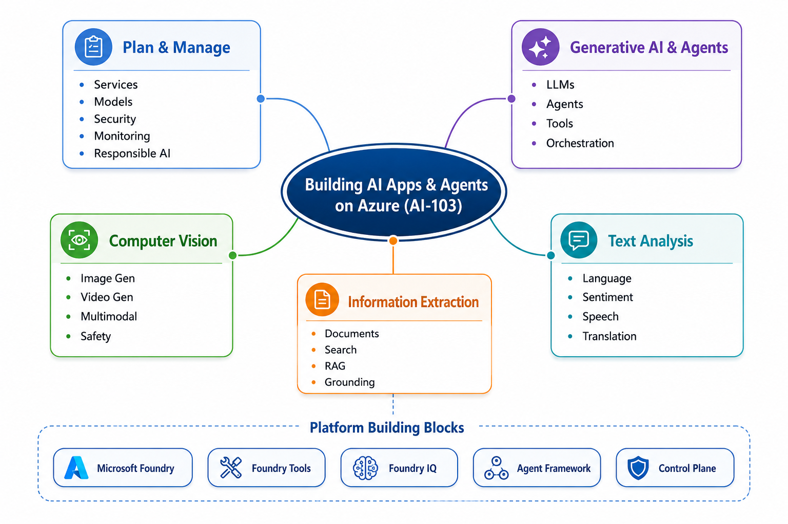

# AI-103 — Plan & Manage: Foundry Foundations



## The exam mindset

Choose the service, model, deployment, endpoint, and authentication method that best fits the scenario’s:

- Capability required
- Data-residency/compliance requirements
- Cost and throughput needs
- Need for Foundry-specific functionality
- Security requirements

## Foundry at a glance

A Microsoft Foundry resource provides unified access to:

| Need | Use |
|---|---|
| Models and model deployments | Foundry Models |
| Agents, evaluations, tracing, project configuration | Foundry SDK + project endpoint |
| Vision, Speech, Translator, Content Safety, Content Understanding, etc. | Foundry Tools |
| Agent knowledge, search, memory, MCP integrations | Foundry platform tools / knowledge connections |

A **project** is the working boundary for AI assets, connections, data, evaluations, and tracing.

## Pick the right model

| Scenario | Best fit |
|---|---|
| Complex reasoning, coding, multi-step work | LLM or reasoning model |
| Lower cost, lower latency, routine language task, edge | SLM |
| Semantic search / RAG retrieval | Embedding model |
| Text + image/video understanding | Multimodal model |
| Image, video, speech generation | Specialist generative model |
| Predictable extraction/translation/speech/OCR | Foundry Tool rather than an LLM alone |

Model selection is never solely “highest quality.” Balance quality, safety, latency, throughput, price, region, and licensing.

## Deployment types: choose from the requirement

| Requirement | Best answer |
|---|---|
| Default choice: broad availability, highest quota, pay per token | **Global Standard** |
| Consistent, high-volume workload; predictable throughput and lower latency variation | **Global Provisioned** (reserved PTUs) |
| Large, non-urgent asynchronous workload at lower cost | **Global Batch** |
| Processing must stay in EU, US, or APAC data zone | **Data Zone Standard** |
| Data-zone processing plus predictable capacity | **Data Zone Provisioned** |
| Processing must remain in the chosen Azure geography | **Standard** or **Regional Provisioned** |
| Short evaluation of a fine-tuned model | **Developer** |

Memory hook: **Standard = consumption; Provisioned = reserved capacity; Batch = discounted async.**

Do not assume every model supports every deployment type.

## SDK + endpoint decision

| Need | SDK / endpoint |
|---|---|
| Agents, project configuration, tracing, evaluations, platform tools | **Foundry SDK** + project endpoint |
| Maximum OpenAI compatibility, lowest latency, embeddings, Chat Completions | **OpenAI SDK** + Azure OpenAI `/openai/v1` endpoint |
| Anthropic models in Foundry | Anthropic SDK + Anthropic endpoint |
| Vision, Speech, Translator, Content Safety, etc. | Tool-specific SDK + endpoint |

Key distinction:

- **Foundry project endpoint:** `https://<resource>.services.ai.azure.com/api/projects/<project>`
- **Azure OpenAI endpoint:** `https://<resource>.openai.azure.com/openai/v1`

Most real solutions use both: Foundry SDK for platform operations, OpenAI-compatible client for inference.

## Authentication + security

- Prefer **Microsoft Entra ID / managed identity** in production: keyless, centrally governed, no secret rotation in app code.
- Use API keys only when appropriate; store them in Key Vault, never source code.
- Use least-privilege RBAC.
- For sensitive production traffic, consider private networking/VNet integration.
- Restrict tool access and require approvals for consequential agent actions.

## Model evaluation essentials

| Evaluator | Question it answers |
|---|---|
| Groundedness | Is the answer supported by supplied context? |
| Relevance | Does it answer the user’s question? |
| Coherence | Does it make logical sense? |
| Fluency | Is it natural and well-written? |
| Task completion | Did the agent achieve the requested outcome? |
| Safety evaluators | Does it contain hate/unfairness, sexual, violent, or self-harm content? |

Evaluate before release, after meaningful changes, and continuously in production with traces/telemetry.

## Foundry Tools
1. **Azure Language**- Text analysis: entity extraction, sentiment analysis, summarization
   - Supports conversational language models and Q&A solutions
2. **Azure Speech** - Text‑to‑speech and speech‑to‑text
    - Real‑time speech for conversational apps and agents
3. **Azure Translator** - High‑quality translation across many languages
4. **Azure Document Intelligence** - Extract fields from documents (invoices, receipts, forms) using prebuilt or custom models
5. **Azure Content Understanding**


## High-value traps

- “Global” does **not** mean a fixed region. Processing can occur in any Azure region.
- “Data Zone” means processing stays in a Microsoft-defined US, EU, or APAC zone—not necessarily one region.
- RAG needs an **embedding/retrieval** solution; it is not a fine-tuning substitute.
- Foundry-specific capabilities such as agents, evaluations, and platform tools point toward the **Foundry SDK/project endpoint**.
- An LLM may request a function call; **your application** validates and executes it.

## Quick Exam Memory Block

```text
Plan first.
Choose the smallest suitable model.
Use dedicated Azure AI services for specific tasks.
Use RAG when the answer must come from private or current data.
Use Azure AI Search for indexing and retrieval.
Use hybrid search when both keyword precision and semantic meaning matter.
Use managed identity and RBAC for production access.
Use Content Safety for unsafe content, prompt attacks, and groundedness checks.
Limit agent tools.
Add human approval for sensitive actions.
Monitor cost, latency, retrieval quality, safety, and grounding.
```