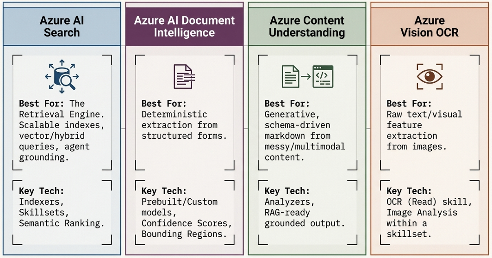
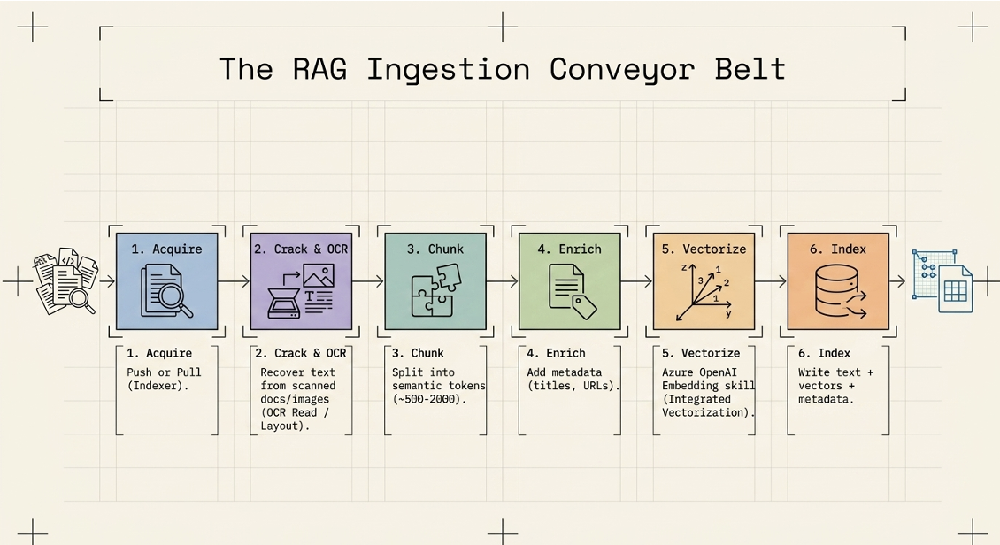

# Foundry Tools

### Top Exam Traps (High-Yield)

1. **Speech translation vs. text translation** — Speech handles audio I/O; Translator handles text only.
2. **Document Intelligence vs. Content Understanding**: Document Intelligence is for structured document extraction (forms, invoices). Content Understanding handles broader media (audio, video, images).
3. **Content Safety vs. Prompt Shields**: Content Safety detects harmful content; Prompt Shields detects jailbreak/indirect prompt injection attacks.
4. **Async analyze operations**: Document Intelligence and Content Understanding both use **submit-then-poll** patterns  (`begin_*()` → `.result()`). Don't expect immediate results.
5. **Deprecated services**: If a question mentions LUIS or QnA Maker, the correct answer is their modern replacement (CLU or Custom Question Answering).
6. **TTS uses OpenAI SDK, STT uses Speech SDK** — A common source of confusion.

### Foundry Tools Quick Reference

|Here is the full table with the **Prerequisites / Requirements** column updated to show only the **unique requirements** beyond the assumed Azure subscription and base resource.

| Tool | Main Purpose | SDK Function Call / Client Method | Prerequisites / Requirements | Exam Gotchas |
|---|---|---|---|---|
| **Azure Speech** (TTS) | Text to speech; generate audio from text | `client.audio.speech.with_streaming_response.create(model, voice, input)` | **Azure Storage account + Blob container + SAS URL** (for MCP server to save audio) | **TTS ≠ STT.** TTS uses the **OpenAI SDK** (`AzureOpenAI`), not the Speech SDK. |
| **Azure Speech** (STT) | Speech to text; real-time transcription | `speech_recognizer.recognize_once_async().get()` | **None** (real-time). **Blob Storage** required for batch transcription. | Uses the **Speech SDK**, not the OpenAI client. Requires `SpeechConfig` + `AudioConfig`. |
| **Azure Translator** (Text) | Real-time text translation | `client.translate(body=["Hello"], to=["es"])` | **None** | **Text translation ≠ document translation.** Uses `TextTranslationClient`. |
| **Azure Translator** (Document) | Asynchronous batch document translation | `client.document_translate(body, target_language="de")` | **Azure Blob Storage account + source container + target container** | **Async operation.** Returns an iterator of bytes. Separate SDK (`azure-ai-translation-document`). |
| **Azure Language** | NLP: NER, PII, sentiment, summarization, CLU, custom classification | `client.analyze_text(body)` | **None** | **LUIS and QnA Maker are retired.** Use **CLU** and **Custom Question Answering**. |
| **Content Understanding** | Analyze multimodal content (documents, images, audio, video) | `poller = client.begin_analyze(analyzer_id, inputs=[AnalysisInput(url=...)])` | **Microsoft Foundry resource + three model deployments** (GPT-4.1, GPT-4.1-mini, text-embedding-3-large) | **Must use Foundry service root endpoint**, not project endpoint. **Async** — returns a poller. |
| **Document Intelligence** | Extract structured data from documents: OCR, tables, key-value pairs, prebuilt models | `poller = client.begin_analyze_document("prebuilt-receipt", body=f)` | **Standard performance Azure Blob Storage + role assignments** (for custom projects only). Basic roles: Cognitive Services User + Storage Blob Data Contributor. | **Analyze is async** — poll for results. Use **`prebuilt-*`** model IDs. |
| **Azure Vision** | Analyze images: captions, tags, objects, OCR, people, smart crops | `client.analyze(image_data, visual_features=[VisualFeatures.CAPTION])` | **None** | **OCR is part of Vision**, but for structured document extraction use **Document Intelligence** instead. |
| **Azure AI Search** | AI-powered cloud search: vector, keyword, and hybrid queries | `search_client.search(search_text, vector_queries=[...])` | **Azure Storage account (Blob Storage or ADLS Gen2) + Storage Blob Data Reader role** | **Search is retrieval, not generation.** Pair with Azure OpenAI for RAG. |
| **Content Safety** | Detect harmful content in text and images | `response = client.analyze_text(AnalyzeTextOptions(text="..."))` | **None** (container deployment requires NVIDIA CUDA) | **Severity scale is 0–6**, not 0–10. **Content Safety ≠ Prompt Shields.** |
| **Custom Vision** | Custom image classification and object detection | `predictor.classify_image(project_id, iteration_name, image_data)` | **Two separate resources: Training + Prediction** | **Not the same as Azure Vision.** Requires two clients: training and prediction. |
| **Immersive Reader** | Accessibility tool to help users read and comprehend text | Launched via **SDK/iframe**, not a direct REST call | **Entra ID authentication + Node.js + Yarn** | **Accessibility tool, not an NLP analysis tool.** Do not select it for text extraction or translation. |

### Memorise these

| Concept                 | Answer                                 |
| ----------------------- | -------------------------------------- |
| Connect to resource     | `SpeechConfig`                         |
| Authentication          | **Endpoint + key**                     |
| Audio input             | `AudioConfig`                          |
| Speech recognition      | `SpeechRecognizer`                     |
| Speech → text           | `recognize_once_async()`               |
| Text synthesis          | `SpeechSynthesizer`                    |
| Text → speech           | `speak_text_async()`                   |
| Change voice            | `speech_synthesis_voice_name`          |
| Change audio format     | `set_speech_synthesis_output_format()` |
| Advanced speech control | **SSML**                               |
| SSML API                | `speak_ssml_async()`                   |
| Successful STT result   | `RecognizedSpeech`                     |
| Successful TTS result   | `SynthesizingAudioCompleted`           |

### Retired / Deprecated Tools (Know These for the Exam)

| Tool | Status | Replacement / Note |
|---|---|---|
| **Anomaly Detector** | Retired | No new apps |
| **Content Moderator** | Retired | Use **Content Safety** |
| **LUIS** | Retired | Use **Conversational Language Understanding (CLU)** |
| **Metrics Advisor** | Retired | No direct replacement in Foundry Tools |
| **Personalizer** | Retired | No new apps |
| **QnA Maker** | Retired | Use **Custom Question Answering** in Azure Language |

