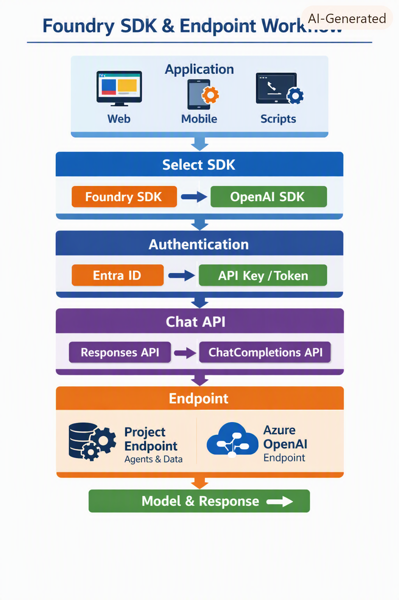

Here’s your **second infographic version**, designed for clarity and exam alignment — a minimalist, flow‑based visualization of how Foundry endpoints, SDKs, and authentication layers interact.  

---

### 🧠 **Foundry SDK & Endpoint Architecture (Simplified Flow)**

#### **1️⃣ Application Layer**
- **Your app** → Web, mobile, or script  
- Chooses **SDK** → Foundry or OpenAI  

#### **2️⃣ SDK Layer**
| SDK | Endpoint | Purpose |
|------|-----------|----------|
| **Foundry SDK** | Project Endpoint | Agents, evaluations, tracing, datasets  |
| **OpenAI SDK** | Azure OpenAI Endpoint | Model inference, chat completions, responses |

> Both SDKs share OpenAI‑compatible clients and can coexist in one app  .

---

#### **3️⃣ Authentication Layer**
- **Entra ID (recommended)** → Secure identity context  
- **API Key / Token / Env Vars** → Alternative methods

> Foundry SDK requires an authenticated Azure session (`az login`) .

---

#### **4️⃣ Chat API Layer**
- **Responses API** → Preferred for new apps 
- **ChatCompletions API** → Legacy, cross‑platform compatibility  

---

#### **5️⃣ Data Flow**
```
App → SDK → Endpoint → Auth → Chat API → Model → Response
```
- Foundry SDK adds project‑level features (agents, evaluations, tracing)  
- OpenAI SDK focuses on inference and portability 

---

### ⚙️ **Dependency Highlights**
| Dependency | Description |
|-------------|--------------|
| Foundry SDK → OpenAI SDK | Chat client derived from OpenAI  |
| SDK → Endpoint | Must match endpoint type (Project or Azure OpenAI) |
| SDK → Auth | Entra ID or key/token required |
| Chat API → SDK | Both SDKs expose OpenAI‑compatible chat clients |

### Connecting to the project endpoint

```python
from azure.identity import DefaultAzureCredential
from azure.ai.projects import AIProjectClient

project_endpoint = "https://{resource-name}.services.ai.azure.com/api/projects/<project-name>"
project_client = AIProjectClient(
    credential=DefaultAzureCredential(),
    endpoint=project_endpoint
)
```

### Connecting to the OpenAI endpoint

```python
from openai import OpenAI
from azure.identity import DefaultAzureCredential, get_bearer_token_provider

token_provider = get_bearer_token_provider(
    DefaultAzureCredential(), "https://ai.azure.com/.default"
)

openai_client = OpenAI(  
  base_url = "https://{resource-name}.openai.azure.com/openai/v1/",  
  api_key=token_provider,
)
```

API key auth:
```python
import os
from openai import OpenAI

openai_client = OpenAI(
    api_key=os.getenv("AZURE_OPENAI_API_KEY"),
    base_url="https://{resource-name}.openai.azure.com/openai/v1/"
)
```

Environment variables:
```python
from openai import OpenAI

openai_client = OpenAI()  # Uses environment variables

```

### 🛠️ SDK decision checklist

- **Foundry SDK** IF: Agents, Evaluations, Tracing, Project metadata, Foundry direct models, Tool workflows.
These do not exist in the OpenAI SDK.

- **OpenAI SDK** IF: Maximum portability, API key auth, Existing OpenAI-compatible code, Simple inference
These do not exist in the Foundry SDK

- :star: **Choose Both** if you need: Foundry-native features AND OpenAI-style inference portability

---

