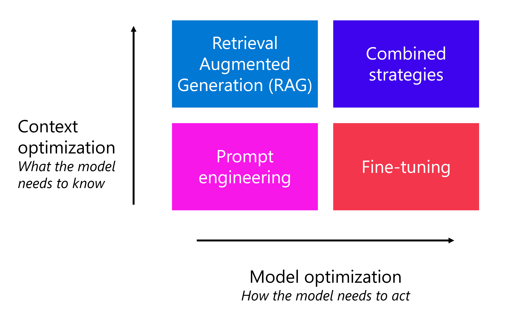
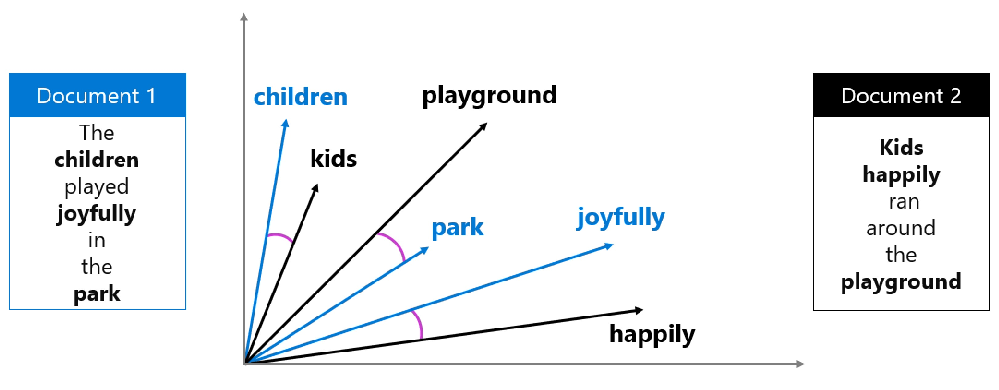

# Optimizing Generative AI Model Performance with Foundry


## **Why Optimization Matters**
- Base models are powerful but often **don’t meet all requirements** out of the box.  
- Response **quality, accuracy, and consistency** depend heavily on how the model is configured and augmented.



## **Example Scenario**
A travel‑agency developer needs the model to:
- Follow a **specific tone of voice**  
- Provide **accurate hotel information**  
- Maintain a **consistent response format**

This highlights the need for optimization beyond the base model.


---

# Optimize Model Output with Prompt Engineering

## What Prompt Engineering Is
Prompt engineering is the practice of designing and refining prompts to improve the **quality**, **accuracy**, and **relevance** of model responses.  
It requires **no extra infrastructure or training data**, making it the fastest and most accessible optimization method.

## Core Prompt Components
- **System message** — Defines the model’s role, tone, boundaries, and output format.  
- **User message** — The user’s actual question or instruction.  
- **Assistant message** — Previous responses in multi‑turn conversations.  
- **Examples** — Input/output pairs showing the desired pattern.

## Designing Effective System Messages
A strong system message:
- Sets the assistant’s role  
- Defines boundaries and out‑of‑scope topics  
- Specifies output format (JSON, bullets, templates)  
- Includes a “when unsure” policy  
- Requires iterative testing because compliance is not guaranteed

## Prompt Patterns
- **Persona pattern** — Assign a role or perspective to shape tone and expertise.  
- **Format template pattern** — Provide a structure the model must follow.  
- **Chain‑of‑thought pattern** — Ask for step‑by‑step reasoning or break tasks into sub‑steps.  
- **Few‑shot pattern** — Provide examples to teach the model the desired pattern.

## Clarity Techniques
- Use delimiters (---, headings, XML tags) to separate instructions from content.  
- Repeat key instructions at the end to counter recency bias.

---

## Model Parameters
- **Temperature** — Controls randomness; low for factual tasks, high for creative tasks.  
- **Top_p** — Alternative randomness control; generally adjust *either* temperature or top_p, not both.

---

## When Prompt Engineering Is Enough
Use it when you need to:
- Guide tone, format, and behavior  
- Provide task‑specific instructions  
- Iterate quickly  
- Avoid extra cost or infrastructure

Prompt engineering has limits: if the model lacks required knowledge or cannot maintain strict behavior, additional optimization strategies are needed.

---

# Ground Your Model with Retrieval Augmented Generation (RAG)

## Why Grounding Is Needed
- Prompt engineering can shape *how* a model responds, but it **cannot give the model new knowledge**.
- Models only know what’s in their **training data**, which has a cutoff date and excludes private organizational data.
- Without grounding, models may produce **plausible but incorrect** or **fabricated** answers.

## What Grounding Does
- You supply **trusted, factual data** along with the user’s query.
- The model uses this data to generate **accurate, context‑relevant** responses.
- Example: Ungrounded hotel queries may invent hotels; grounded queries return **real catalog data**.

## What RAG Is
Retrieval Augmented Generation (RAG) is a pattern with three steps:

1. **Retrieve** — Search a data source for relevant information.  
2. **Augment** — Add that information to the prompt.  
3. **Generate** — The model produces a grounded response using the supplied context.

RAG ensures the model uses **current, domain‑specific** information instead of relying solely on training data.

## Embeddings & Vector Search
- Embeddings convert text into vectors that represent semantic meaning.
- Similar meanings → vectors close together.
- **Cosine similarity** measures how close two vectors are.
- This enables retrieval of relevant documents even when wording differs.



## Azure AI Search for Retrieval
Azure AI Search provides:
- **Keyword search**  
- **Semantic search**  
- **Vector search**  
- **Hybrid search** (recommended)

Workflow:
1. Add your data to Foundry.  
2. Create an index using embeddings.  
3. Convert user queries to embeddings.  
4. Retrieve the most relevant documents.

## Implementing RAG in Foundry
- Use the **azure‑ai‑projects SDK** to connect Azure AI Search results to a model.
- Inject retrieved context into the system or user message.
- The model then responds using **your actual data**, not general training knowledge.

```python
# In this example, **retrieved_context** represents the documents returned from your Azure AI Search index
client = project.get_openai_client()

response = client.responses.create(
    model="gpt-4o",
    input=[
        {"role": "system", "content": "You are a helpful travel advisor. "
         "Use the following hotel data to answer: " + retrieved_context},
        {"role": "user", "content": "Which hotels do you offer in Paris?"},
    ],
```


## When to Use RAG
RAG is ideal when:
- You need **domain‑specific knowledge** (catalogs, policies, internal docs).  
- Information **changes frequently** (inventory, pricing, news).  
- **Factual accuracy** is critical.  
- You need data **beyond the model’s training cutoff**.

---

# Fine‑Tune a Model for Consistent Behavior

## Why Fine‑Tuning Matters
Prompt engineering and RAG can guide and ground a model, but sometimes the model still:
- Ignores instructions  
- Produces inconsistent tone or formatting  
- Fails to follow strict output structures  

Fine‑tuning solves this by **training the model on your own examples**, embedding your desired patterns directly into the model.

## What Fine‑Tuning Is
- You take a **pretrained foundation model** and train it further on a **task‑specific dataset**.
- This adjusts internal weights so the model consistently follows your style, tone, and formatting.
- Foundry uses **LoRA**, which updates only a small subset of parameters → faster, cheaper, and efficient.

## When to Fine‑Tune
Fine‑tuning is ideal when you need:
- **Consistent brand voice**  
- **Reliable structured output** (e.g., strict JSON schemas)  
- **Shorter prompts** (embedding examples into the model instead of repeating them)  
- **Distillation** (teaching a smaller model using outputs from a larger one)  
- **Better tool‑calling accuracy**  

> Always evaluate baseline performance first to ensure fine‑tuning is actually needed.


## Types of Fine‑Tuning
### 1. Supervised Fine‑Tuning (SFT)
Train on labeled prompt–response pairs.  
Best for tasks with clear, predictable patterns.

### 2. Reinforcement Fine‑Tuning (RFT)
Use iterative feedback and a grader to reward better responses.  
Best for complex reasoning tasks.

### 3. Direct Preference Optimization (DPO)
Train using preferred vs. non‑preferred responses.  
Lightweight and effective for alignment.

> You can **combine techniques** (e.g., SFT → DPO).

## Training Data Requirements
- Format: **JSONL**  (JSON Lines)
- Each example includes system, user, and assistant messages.  
- Use a **consistent system message** across all examples.  
- Provide **high‑quality, representative** examples.  
- Aim for **hundreds+** of examples.  
- Assistant responses must match the exact tone, style, and format you want.

## Challenges & Costs
- **Training + hosting costs**  
- **High data quality required**  
- **Maintenance** when data or base models change  
- **Hyperparameter tuning**  
- **Risk of over‑specialization** (model becomes too narrow)

## **Outcome**
Fine‑tuning produces a model that **naturally** follows your brand voice, formatting rules, and behavior — without needing long system messages or many examples.

---

# Compare & Combine Optimization Strategies

## Core Idea
Prompt engineering, RAG, and fine‑tuning are **complementary** optimization methods. They address different weaknesses in generative AI models and can be layered together for stronger performance.

| **Strategy** | **Primary Purpose** | **Time to Implement** | **Complexity** | **Cost** | **Best For** |
| --- | --- | --- | --- | --- | --- |
| **Prompt Engineering** | Shape tone, structure, and behavior | **Minutes to hours** | **Low** | **Low** | Quick iteration, guardrails, formatting, lightweight control |
| **RAG (Retrieval Augmented Generation)** | Add domain‑specific, up‑to‑date knowledge | **Hours to days** | **Medium** | **Medium** | Accurate, grounded responses using private or current data |
| **Fine‑Tuning** | Make behavior consistent and predictable | **Days to weeks** | **High** | **High** | Strict formatting, brand voice, shorter prompts, reliable tool‑calling |

## The Optimization Spectrum

| **Strategy** | **Use When…** | **What It Provides** |
| --- | --- | --- |
| **Optimize for Context (RAG)** | - Model lacks domain‑specific knowledge<br>- Needs accurate, up‑to‑date, or private data | Retrieves relevant external information and injects it into the prompt for grounded, factual responses |
| **Optimize the Model (Fine‑Tuning)** | - Need consistent tone, style, formatting<br>- Require strict output structure<br>- Want shorter prompts<br>- Need reliable tool‑calling | Embeds desired behavior directly into the model so it naturally follows your patterns |
| **Prompt Engineering (Foundation Layer)** | - Need to guide tone, structure, behavior<br>- Want to provide examples<br>- Need guardrails<br- Want fast, low‑cost iteration | Shapes how the model responds using instructions, examples, and formatting patterns |

Prompt engineering supports both RAG and fine‑tuning.


## Common Strategy Combinations

| **Combination** | **When to Use** | **How They Work Together** |
| --- | --- | --- |
| **Prompt Engineering + RAG** | Most common pairing; use when you need both behavior control and factual grounding | Prompt engineering defines tone/structure; RAG injects accurate domain data |
| **Prompt Engineering + Fine‑Tuning** | When strict style, formatting, or brand voice is required | Fine‑tuning sets baseline behavior; system messages add session‑specific instructions |
| **RAG + Fine‑Tuning** | When you need consistent voice *and* accurate, up‑to‑date domain knowledge | Fine‑tuning ensures consistency; RAG provides factual grounding |
| **All Three Together** | For demanding applications requiring consistency, grounding, and dynamic behavior control | Fine‑tuning → consistent style; RAG → factual grounding; prompt engineering → conversation‑specific instructions |

## ⚙️ Decision Framework
1. **Start with prompt engineering**  
2. **Add RAG** if accuracy or domain knowledge is required  
3. **Add fine‑tuning** if consistency or strict formatting is required  
4. **Combine as needed** — not every app needs all three

---


## 🧠 Key Takeaway
Prompt engineering, RAG, and fine‑tuning are **complementary**, not competing.  
Each addresses a different dimension of model performance:

- **Prompt engineering** → guides behavior  
- **RAG** → provides factual grounding  
- **Fine‑tuning** → enforces consistent style and structure  

> Start with prompt engineering, add RAG when accuracy requires real data, and use fine‑tuning when you need reliable formatting or brand voice.
