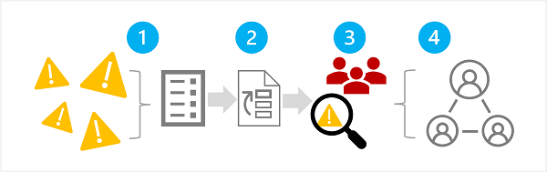
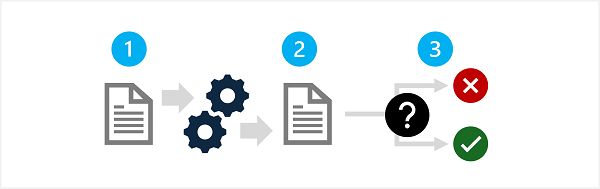
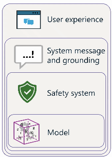

# Implement a responsible generative AI solution in Microsoft Foundry

Generative AI enables amazing creative solutions, but must be implemented responsibly to minimize the risk of harmful content generation.

---

## Plan a responsible generative AI solution

| **Stage** | **Description** |
| --- | --- |
| **Map** | Identify potential harms that are relevant to your planned solution. |
| **Measure** | Evaluate how these harms appear in the outputs generated by your solution. |
| **Mitigate** | Reduce harms across multiple layers of the solution and ensure transparent communication about potential risks to users. |
| **Manage** | Deploy and operate the solution responsibly by defining and following an operational readiness plan. |

---

## 1. Map Potential Harms

This stage teaches you how to **identify, prioritize, test, and document** potential harms in a generative AI solution.

| **Stage** | **Item** | **Description** |
| --- | --- | --- |
| **1. Identify Potential Harms** | Offensive / discriminatory output | Model generates harmful or biased content |
|  | Factual inaccuracies | Model produces incorrect or misleading information |
|  | Illegal / unethical guidance | Model outputs instructions that enable harmful behavior |
| **2. Prioritize Harms** | Likelihood | How often the harm is expected to occur |
|  | Impact | Severity of the harm if it occurs |
|  | Usage context | How the solution will be used and potential misuse scenarios |
| **3. Test & Verify Harms** | Red‑team testing | Actively probe the system to trigger harmful outputs |
|  | Scenario‑based tests | Use realistic prompts to expose vulnerabilities |
|  | Discovery of new harms | Add newly found issues to the harm list |
| **4. Document & Share** | Record evidence | Capture verified harms and their triggers |
|  | Maintain harm list | Update as new harms are discovered |
|  | Share with stakeholders | Ensure transparency and alignment across teams |

---

## 2. Meazure Potential Harms

| **Step** | **Action** | **Purpose** |
| --- | --- | --- |
| **1. Prepare Prompts** | Create diverse prompts likely to trigger each documented harm | Ensure each harm scenario is tested |
| **2. Submit Prompts** | Run prompts through the system and collect outputs | Capture real model behavior |
| **3. Evaluate Outputs** | Apply strict, predefined criteria to classify harm level (e.g., harmful / not harmful or multi‑level scale) | Consistently categorize severity of harm |

#### Test Potential Harms

| **Method** | **Description** | **Why It Matters** |
| --- | --- | --- |
| **Manual Testing** | Start with a small set of inputs and evaluate outputs yourself | Ensures criteria are clear and consistent |
| **Automated Testing** | Scale testing using automation or classification models | Enables large‑volume harm measurement |
| **Periodic Manual Checks** | Re‑test manually even after automation is in place | Validates new scenarios and ensures automation accuracy |

#### Document Potential Harms

| **Action** | **Purpose** |
| --- | --- |
| Record results | Maintain evidence of harmful outputs and their triggers |
| Share with stakeholders | Ensure transparency and alignment across teams |

---

## 3. Mitigate Potential Harms

| **Layer** | **What It Is** | **Key Mitigations** |
| --- | --- | --- |
| **Model Layer** | The generative AI model(s) powering the solution | • Choose an appropriate model for the task • **Fine‑tune** to reduce irrelevant or harmful outputs |
| **Safety System Layer** | Platform‑level guardrails and filters | • Use content filters (safe → high severity) • Apply guardrails and **prompt shields** to detect abuse e.g. for **five categories of potential harm** (hate and fairness, sexual, violence, self-harm, and task-adherence) |
| **System Message & Grounding Layer** | How prompts are constructed and contextualized | • Define behavioral parameters via system messages • Use prompt engineering and grounding • Apply **RAG** to include trusted contextual data |
| **User Experience Layer** | The application UI and user‑facing documentation | • Constrain user inputs; validate inputs/outputs • Provide transparent documentation on capabilities, limits, and residual risks |

---

## 4. Manage Potential Harms

> Manage how to operate and maintain a generative AI solution responsibly after deployment.

> **GOAL** Ensure the AI system remains safe, transparent, and aligned with responsible AI principles throughout its lifecycle.

| **Focus Area** | **Key Actions** |
| --- | --- |
| **Phased Release** | Launch first to a limited user group to gather feedback and detect issues before full rollout. |
| **Incident Response** | Define clear response procedures and time estimates for unexpected incidents. |
| **Rollback Plan** | Prepare steps to revert to a previous stable version if problems occur. |
| **Blocking Harmful Outputs** | Enable immediate blocking of harmful system responses. |
| **User / App / IP Blocking** | Implement controls to block misuse from specific users, apps, or IPs. |
| **User Feedback** | Provide channels for users to report inaccurate, incomplete, or harmful content. |
| **Telemetry & Privacy** | Track satisfaction and usability metrics while complying with privacy laws and organizational policies. |
