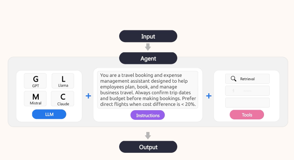
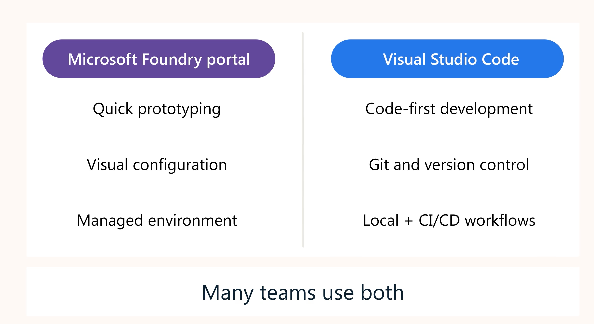

# Develop AI agents with Microsoft Foundry and Visual Studio Code

## Learning objectives

- Describe the purpose and capabilities of AI agents
- Explain the key features of Microsoft Foundry Agent Service
- Set up and configure the Microsoft Foundry extension in Visual Studio Code
- Build and configure AI agents using multiple development approaches
- Extend agent capabilities with tools and functions
- Test agents using integrated playgrounds
- Deploy and integrate agents into applications

---

## Understanding AI agents in Foundry



## Agent Types
**Declarative Agents** - Configured, not coded.
- Prompt‑based agents - Single agent, Model + instructions + tools + prompts, Most common.
- Workflow agents - Multi‑agent orchestration, YAML‑defined, Complex collaboration.
**Hosted Agents** - Containerized, Full control over logic, Foundry manages infrastructure


# **TL;DR**  
AI agents = autonomous services using generative AI + tools to act on goals. Foundry Agent Service = secure, managed platform to build declarative or hosted agents with minimal code.


# **Understand AI Agents & Microsoft Foundry Agent Service**

## **What AI Agents Are**  
- **AI agent** — software service using generative AI to understand context + perform tasks.  
- Operates independently; makes decisions + takes actions.  
- Uses models + tools for adaptive automation.  
- Generative AI evolution enables intelligent behaviour across scenarios.


## **Why Agents Are Useful**  
- **Automation** — removes repetitive work → productivity.  
- **Decision‑making** — analyzes data, predicts outcomes, recommends actions.  
- **Scalability** — expands operations without extra staff.  
- **24/7 availability** — continuous service delivery.

## **Use Cases**  
- **Personal productivity** — scheduling, emails; Microsoft 365 Copilot.  
- **Research** — trend monitoring, reporting.  
- **Sales** — lead generation, follow‑ups.  
- **Customer service** — routine inquiries; Cineplex refunds.  
- **Developer agents** — code review, repo management; GitHub Copilot.

## **Security Considerations**  
Risks: data leakage, prompt injection, unauthorized access, data poisoning, supply‑chain vulnerabilities, autonomy errors, weak logging, model inversion.  
Mitigations: RBAC, prompt filtering, sandboxing, logging, dependency audits, model validation.

## **Microsoft Foundry Agent Service**  
- Fully managed platform to build, deploy, scale agents.  
- Create agents with <50 lines of code.  
- Build via portal or integrate into apps.

### **Agent Types**  
- **Declarative agents** — config‑based.  
  - **Prompt‑based** — single agent with model + tools + instructions.  
  - **Workflow agents** — multi‑agent YAML orchestrations.  
- **Hosted agents** — containerized, full control; platform manages infra.

### **Key Features**  
Automatic tool calling, secure conversation state, large tool catalog, model choice, enterprise security, custom storage, observability + tracing.

### **Comparison Table — Declarative vs Hosted**

| Feature | Declarative Agents | Hosted Agents |
|--------|--------------------|---------------|
| Definition | Config‑based | Container‑based |
| Control | Medium | Full |
| Complexity | Low | High |
| Best For | Fast prototyping | Custom logic |
| Infra | Managed | Managed (you control code) |

### **Key Exam Traps**  
- Agents ≠ chat models.  
- Declarative ≠ hosted.  
- Tool calling is automatic.  
- Conversation state not stored manually.  
- Prompt injection not solved by model choice alone.

### **Mnemonic — AGENT**  
**A**utonomous  
**G**enerative AI + tools  
**E**nterprise security  
**N**o manual infra  
**T**ypes: declarative + hosted

### **Rapid Recall (5‑point)**  
1. Autonomous + generative AI + tools.  
2. Benefits: automate, decide, scale, 24/7.  
3. Use cases: productivity, research, sales, support, dev.  
4. Risks: leakage, injection, access, poisoning, autonomy.  
5. Foundry: declarative/hosted, secure, tool calling, tracing.

---

## Explore Development Approaches



### **Foundry Portal - Best for**
- Rapid prototyping  
- Visual configuration (forms, dropdowns)  
- Collaboration with non‑technical stakeholders  
- Centralized management of agents  
- Monitoring token usage, latency, evaluations  
- Starting quickly without installing tools

### **Visual Studio Code Extension - Best for**
- Developer workflows  
- Version control (Git)  
- Rapid iteration in a familiar coding environment  
- YAML‑based configuration  
- Local development before deploying to Azure  
- Tight integration with application code

### **Key capabilities**
- **Resources panel:** manage models, declarative agents, hosted agents, connections, vector stores  
- **Tools:** model catalog, playgrounds, agent playgrounds, local visualizer, hosted agent deployment  
- **Agent Designer:** visual configuration + code generation  
- **Direct YAML editing:** precise control over agent behavior

## **Typical development workflow (both approaches)**
1. Connect to your Foundry project  
2. Create an agent with a name + purpose  
3. Configure instructions  
4. Add tools  
5. Test in playgrounds  
6. Iterate  
7. Deploy  
8. Integrate into applications

Both approaches support the same workflow — only the interface differs.

## **Required Azure resources**
- **Foundry project** (automatically provisions infrastructure)  
- **Model deployments** (GPT‑4.1, Claude Sonnet, etc.)

Azure services like AI Search, Storage, Key Vault, or Functions are **optional**, depending on your agent’s capabilities.

## **Choosing your development approach**
- **Use Foundry Portal** → visual configuration, quick prototyping, stakeholder review  
- **Use VS Code** → developer‑centric workflows, version control, code‑first precision  
- Many teams use **both**: portal for early design, VS Code for production‑ready development.

---

# Build your first agent in Microsoft Foundry


## **Rapid Recall (5 points)**
1. Foundry portal = visual, no‑code agent builder.  
2. Create agent → name, description, model.  
3. Instructions define behavior + response style.  
4. Playground tests multi‑turn interactions.  
5. Tools expand capabilities before deployment.

## **Core Concepts (Compressed Bullets)**

#### **Agent Creation**
- Access Foundry via ai.azure.com → open project → Build → Agents → Create.  
- Provide **Name**, **Description**, **Model**.  
- Agent opens in a configuration workspace for behavior + capabilities.

#### **Instructions & Model Properties**
- Instructions define the agent’s role, tone, and decision patterns.  
- Clear instructions = predictable, consistent behavior.  
- Configure **Temperature** (randomness) and **Top‑P** (diversity).

#### **Testing in Playground**
- Built‑in chat interface for validating instructions.  
- Supports multi‑turn testing to ensure context retention.  
- Iterate quickly before adding tools or deploying.

#### **Tools**
- **Configured tools**: built‑in (Code Interpreter, File Search).  
- **Catalog tools**: Bing Search, Azure AI Search, SharePoint, etc.  
- **Custom tools**: OpenAPI or MCP servers.  
- Tools extend the agent beyond pure LLM reasoning.

#### **Deployment**
- Deploy once testing is stable.  
- Portal shows deployment status + connection details.  
- Integrate via Foundry SDK or REST API.


### **Comparison Table (Portal vs VS Code)**

| Feature | Foundry Portal | VS Code |
|--------|----------------|---------|
| Interface | Visual, no‑code | Code‑first, YAML |
| Best for | Rapid prototyping | Developer workflows |
| Testing | Built‑in playground | Local + integrated tools |
| Tooling | Catalog UI | Full extension capabilities |
| Control | Guided | Precise, customizable |


### **Key Exam Traps**
- Portal = **no‑code**, VS Code = **code‑first**.  
- Instructions are **mandatory**, not optional.  
- Temperature controls randomness, not creativity.  
- Tools must be added **before** deployment.  
- Playground validates **multi‑turn**, not just single prompts.

---

# Configure and manage agents in Visual Studio Code

# **Rapid Recall (5 points)**
1. VS Code extension = visual Agent Designer + YAML editing.  
2. Declarative agents use a specific YAML schema.  
3. Key properties: name, model, description, instructions, ID.  
4. Model tuning: temperature + top‑p.  
5. YAML enables version control, bulk edits, templates, automation.

### **Essential Agent Properties**
- **Name**: descriptive, appears in lists/logs.  
- **Model selection**: choose from deployed models; determines response behavior.  
- **Description**: concise explanation of agent purpose.  
- **System instructions**: define personality, behavior, response style.  
- **Agent ID**: auto‑generated; used for API calls.

### **Model Configuration**
- **Temperature**: controls randomness/creativity (low = focused, high = creative).  
- **Top‑P**: controls vocabulary diversity (default 1.0 works for most cases).  
- Parameters appear in both Designer and YAML.

### **YAML Structure**
- Sections: metadata, model config, instructions, tools.  
- YAML enables precise edits when visual UI isn’t ideal.  
- Example YAML shows full agent definition including instructions and model options.

### **Benefits of YAML Editing**
- Version control with Git.  
- Bulk updates across multiple agents.  
- Reusable templates for consistency.  
- Code review integration.  
- Automation via scripts.  
- Real‑time validation in the extension.

### **Best Practices**
- Commit YAML to Git for rollback + review.  
- Use descriptive names and tags.  
- Document complex instructions with comments.  
- Test after every change; small edits can shift behavior.  
- Start simple and iterate.  
- Keep instructions focused; avoid multi‑purpose agents.

# **Comparison Table (Designer vs YAML)**

| Feature | Agent Designer | YAML Editing |
|--------|----------------|--------------|
| Interface | Visual UI | Code‑first |
| Best for | Quick edits, beginners | Precision, automation |
| Sync | Auto‑sync with YAML | Auto‑sync with Designer |
| Strength | Intuitive configuration | Version control + templates |
| Use case | Early prototyping | Production workflows |

# **Key Exam Traps**
- Declarative ≠ hosted ≠ workflow agents — each has different config paths.  
- Temperature is randomness, not “creativity mode.”  
- YAML and Designer stay synchronized; editing one updates the other.  
- Tools section in YAML must be defined even if empty.  
- Overly complex instructions reduce reliability; start simple.

---

# Extend agent capabilities with tools

## **Rapid Recall (5 points)**
1. Tools = programmatic functions agents call automatically.  
2. Built‑in tools: Code Interpreter, File Search, Bing Search, Azure AI Search.  
3. Custom tools via OpenAPI + MCP servers.  
4. Add tools via VS Code Designer or YAML.  
5. Tool best practices: match tools to needs, clear instructions, test thoroughly.


### **What Tools Are**
- Tools are functions agents invoke to complete tasks like code execution, search, or API calls.  
- Agents decide when a tool is needed, call it, process results, and respond naturally.  


### **Built‑In Tools**

| Built‑In Tool | Purpose | Typical Use Cases |
|--------------|---------|-------------------|
| **Code Interpreter** | Executes Python code | Data analysis, math, charts, file manipulation |
| **File Search** | RAG over uploaded documents | Knowledge retrieval, document Q&A ; .pdf, .docx, .txt, .md uploaded to a **vector store**|
| **Bing Web Search** | Real‑time internet search | Current events, external facts, citations |
| **Azure AI Search** | Enterprise indexed search | Corporate knowledge bases, structured search |
| **Browser Automation** | Controls browser actions | Automated workflows, navigation |
| Additional tools| | |
| **Computer Use** | OS‑level actions | File operations, system tasks |
| **Image Generation** | Creates images | Visual outputs, diagrams, creative assets |
| **SharePoint Tooling** | Access SharePoint content | Enterprise document retrieval |
| **Fabric Tools** | Access Microsoft Fabric data | Analytics, lakehouse queries |
| **Deep Research** | Multi‑step research workflows | Complex investigations, long‑form analysis |
| **Agent‑to‑Agent** | Enables agents to collaborate | Multi‑agent orchestration |
| **Custom Code Interpreter** | Custom Python environment | Specialized computation, sandboxed logic |
| **OpenAI tools**| OpenAPI tools allow agents to interact with external APIs | defined by OpenAPI 3.0 specifications, connecting your agents to web services and enterprise systems. |

### **Adding Tools in VS Code**
- Add via **Agent Designer**: Tools panel → Add Tool → configure settings.  
- YAML editing: define `tools:` array with parameters (connection IDs, vector stores).  

```yaml
version: 1.0.0
name: research-assistant
description: Helps with research tasks using code analysis and web search
model:
  id: 'gpt-4o-deployment'
instructions: |
  You're a research assistant helping users gather and analyze information.
  Use Code Interpreter for data analysis and Bing Search for current information.
tools:
  - type: code_interpreter
  - type: bing_grounding
    bing_grounding:
      connection_id: "your-connection-id"
  - type: file_search
    file_search:
      vector_store_ids:
        - "vectorstore-123"
```


### **MCP Servers**
- Standardized protocol for custom tools.  
- Types: Remote, Local, Custom.  
- Benefits: standardization, reuse, community tools, simplified integration.  


### **Tool Best Practices**
- Start with built‑in tools before creating custom ones.  
- Add tools only when they serve a clear purpose—each tool adds latency.  
- Provide explicit instructions telling the agent when and how to use each tool.  
- Keep File Search knowledge bases updated to avoid outdated responses.  
- Test tool invocation thoroughly, including error handling.  
- Combine tools for complex workflows (e.g., Bing Search → Code Interpreter → File Search).


| Feature | Built‑In Tools | Custom Tools / MCP |
|--------|----------------|--------------------|
| Setup | Ready-to-use | Requires OpenAPI or MCP server |
| Reliability | Platform‑maintained | Depends on your implementation |
| Use Cases | Common tasks (code, search, RAG) | Enterprise APIs, specialized workflows |
| Complexity | Low | Medium–High |
| Flexibility | Moderate | Very high |


# **Key Exam Traps**
- File Search ≠ Azure AI Search (uploaded docs vs enterprise indexes).  
- Tools must be configured (vector stores, connection IDs).  
- YAML requires explicit tool entries even if Designer adds them visually.  
- MCP servers are not “plugins”; they are protocol‑based tool providers.  
- More tools = more latency; minimalism improves performance.

---

## Test, Deploy, and Integrate Agents

### **Testing Strategies**
- Test agents across common, edge, and boundary scenarios to ensure reliability.  
- Use playgrounds to validate multi‑turn behavior, context retention, and instruction adherence.  
- Confirm correct tool invocation and proper handling of tool outputs.  
- Track results to identify regressions and improvements over time.

### **Deploying Agents**
- Deployment saves the agent configuration into your project for shared testing.  
- Portal workflow: open agent → verify configuration → save → deploy.  
- VS Code workflow: update YAML or Designer → save to Foundry → deploy (hosted agents use container config).  
- Deployment keeps the agent inside the project workspace for team access.

### **Publishing Agents**
- Publishing creates an **Agent Application**, giving the agent a stable external endpoint. 

```bash
https://<foundry-resource-name>.services.ai.azure.com/api/projects/<project-name>/applications/<app-name>/protocols/openai/responses
```

- Publishing differs from deployment: deployment is internal; publishing exposes the agent to external consumers.  
- Publishing generates:  
  - A dedicated Agent Application with its own identity and authentication policy.  
  - A running deployment of a specific agent version.  
- Publishing can be done from the portal or VS Code.

### **Agent Application Endpoint**
- Published agents expose a stable Responses API endpoint that does not change across versions.  
- Authentication uses Microsoft Entra ID; callers need the correct RBAC role.  
- API keys are not supported.  
- The agent receives its own identity, so permissions must be reassigned for any resources it accesses.

> When you publish an agent, it receives its own dedicated Entra identity, separate from the project's shared identity. Permissions don't transfer automatically. You must reassign RBAC roles to the new agent identity for any resources the agent accesses. If you skip this step, tool calls that work during development fail with authorization errors once the agent is published.

### **Verifying the Endpoint**
- Obtain an access token using Azure CLI.  

```bash
az account get-access-token --resource https://ai.azure.com
```
- Call the endpoint with a POST request to confirm correct behavior.  
```bash
curl -X POST \
  "https://<foundry-resource-name>.services.ai.azure.com/api/projects/<project-name>/applications/<app-name>/protocols/openai/responses?api-version=2025-11-15-preview" \
  -H "Authorization: Bearer <access-token>" \
  -H "Content-Type: application/json" \
  -d '{"input":"Say hello"}'
```
- 403 errors indicate missing RBAC permissions.

### **Updating Published Agents**
- Publish updates after testing changes.  
- Traffic automatically routes to the new version.  
- Endpoint remains stable, so integrations do not break.

### **Integration Code Generation**
- VS Code can generate sample integration code for authentication, sending messages, and processing responses.  
- Useful for quickly wiring agents into applications.

### **Integration Patterns**
- **Web apps:** send user messages to the endpoint; store conversation history client‑side.  
- **Backend workflows:** call the agent from APIs or scheduled jobs; process responses programmatically.  
- **Chatbots:** map sessions to conversations; handle real‑time exchanges.  
- **Background automation:** schedule recurring agent calls; feed system data and update downstream systems.

### **Production Considerations**
- **Monitoring:** track latency, tool success, errors, token usage.  
- **Security:** use managed identities, least privilege, and retention policies.  
- **Cost:** monitor tokens, set limits, apply rate‑limiting.  
- **Error handling:** retries, backoff, input validation.  
- **Conversation management:** store history client‑side because the endpoint is stateless.

