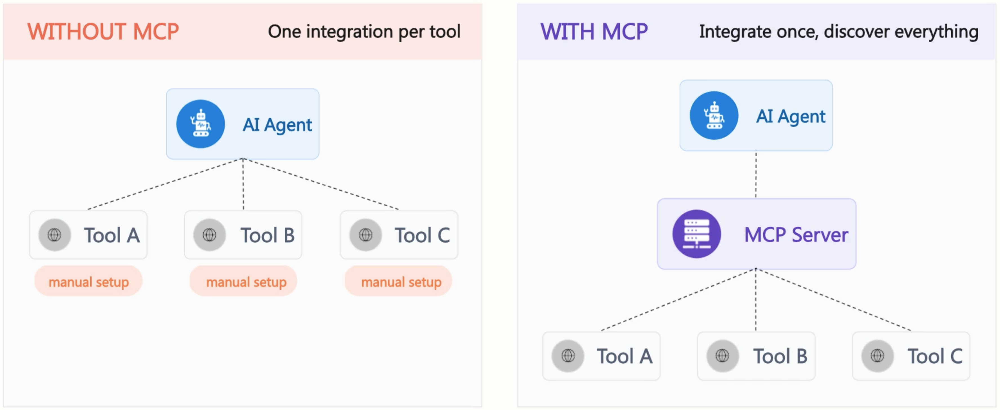
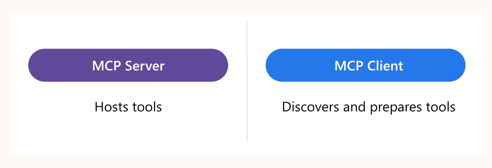
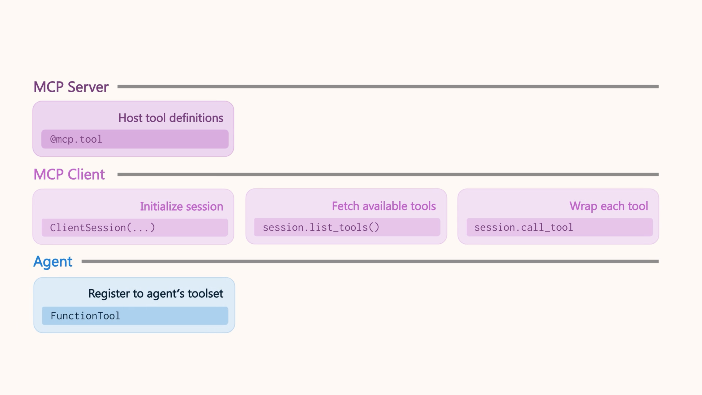
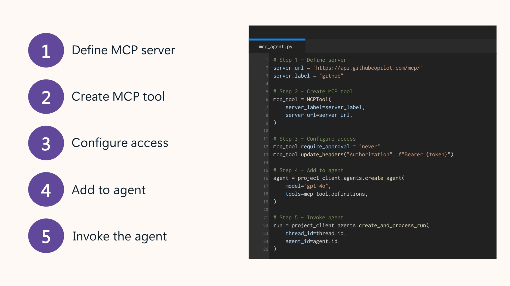

# Integrate MCP Tools with Azure AI Agents


## Connecting Agents to MCP Tools

## Why dynamic tool discovery matters  
As AI agents grow more capable, they rely on more tools and services. Manually registering, updating, and integrating these tools becomes complex. Dynamic tool discovery solves this by letting agents automatically detect available tools when they run.



#### Benefits of MCP  
- **Dynamic tool discovery:** Agents receive an up‑to‑date list of tools from an MCP server.  
- **Interoperability:** Works across different LLMs without re‑writing integrations.  
- **Standardized security:** Provides consistent authentication across MCP servers.

### 🧰 What dynamic tool discovery is  
Instead of hardcoding every tool, the agent queries a centralized MCP server.  
This server acts as a live catalog of tools the agent can understand and call.  
This means tools can be added, updated, or removed without changing agent code.


### 🔌 How MCP enables discovery  
- An MCP server hosts functions and exposes them as tools.  
- A client connects to the server and fetches these tools dynamically.  
- The client generates wrappers that become part of the Azure AI Agent’s toolset.  
- This creates a pipeline:  
  1. MCP server hosts tools  
  2. MCP client discovers tools  
  3. Azure AI Agent uses them to fulfill user requests


### 🎯 Why use MCP for dynamic discovery  
- **Scalability:** Add or update tools without redeploying agents.  
- **Modularity:** Agents stay simple and delegate tool handling.  
- **Maintainability:** Centralized tool management reduces duplication and errors.  
- **Flexibility:** Supports diverse tools and complex workflows.  
- Especially useful in environments where tools evolve quickly or multiple teams manage APIs.

---


### 🔧 What the MCP Server Does  
- Acts as a **registry** of all tools your agent can use.  
- You create it using `FastMCP("server-name")`.  
- FastMCP automatically generates tool definitions from Python type hints and docstrings.  
- These tool definitions are served over HTTP.  
- Because tools live on the server, you can **add or update tools without redeploying your agent**.

### 🔌 What the MCP Client Does  
- Connects your agent to the MCP server.  
- Discovers available tools using `session.list_tools()`.  
- Generates Python wrapper functions for each tool.  
- Registers those functions with your agent so the agent can call them like native functions.  
- Tools are invoked using `session.call_tool(tool_name, tool_args)` and wrapped in async functions for agent compatibility.



### 🔗 How Integration Works (End‑to‑End Flow)  
1. MCP server hosts tool definitions decorated with `@mcp.tool`.  
2. MCP client connects to the server.  
3. Client fetches tool definitions.  
4. Each tool is wrapped in an async function.  
5. Functions are bundled into `FunctionTool` objects.  
6. These tools are registered with the agent.  
7. The agent can now use the tools through natural language requests.

### 🎯 Why This Matters  
Setting up MCP creates a **clean separation** between tool management and agent logic.  
Your agent becomes more flexible, maintainable, and able to adapt quickly as new tools become available.

---

### 🔧 How to enable a MCP Server  



You can connect to multiple MCP servers by adding them to your agent as separate tools. Each MCPTool can include the following parameters:

- **server_label**: A unique identifier for the MCP server (e.g., GitHub).
- **server_url**: The MCP server’s URL.
- **allowed_tools (optional)**: A list of specific tools the agent is allowed to access.
- **require_approval (optional)**: A boolean that determines whether tool invocations require human approval. If set to true, the agent will pause and wait for approval before invoking any tools on the MCP server.

### Using the ```mcp_approval_request```

Use the ```mcp_require_approval``` parameter to determine whether approval is required. Supported values are:
- **always**: A developer needs to provide approval for every call. **If you don't provide a value, this one is the default**.
- **never**: No approval is required.

> If the model tries to invoke a tool in your MCP server **with approval required**, you get an ```mcp_approval_request``` in the agent response. This includes information about which tool is being invoked, and **you can use this information to decide whether to approve the request**. To approve, you send a follow-up message with the mcp_approval_response object, which includes an ``approval_request_id`` value **and an approve boolean**.

When tools are annotated with ```@mcp.tool()```, they **become discoverable to the client**, allowing an AI agent to **call them autonomously** during a conversation or task. 
