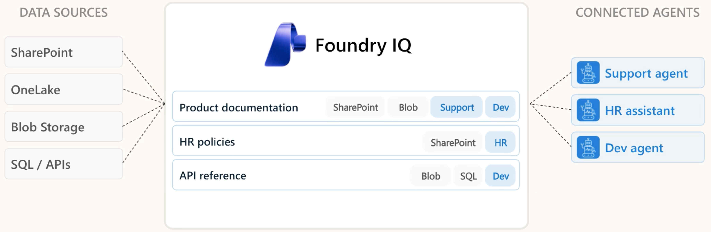
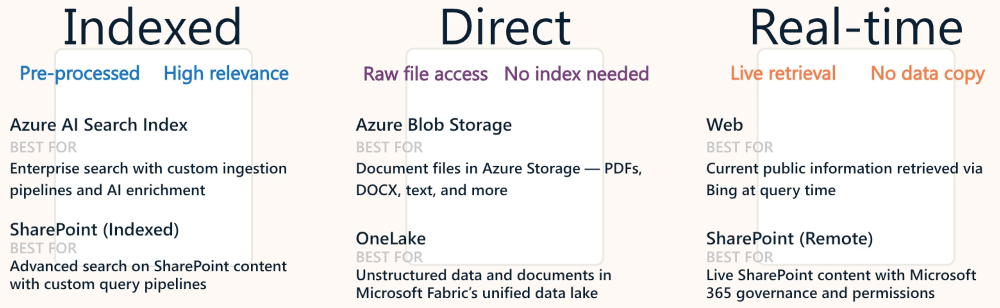
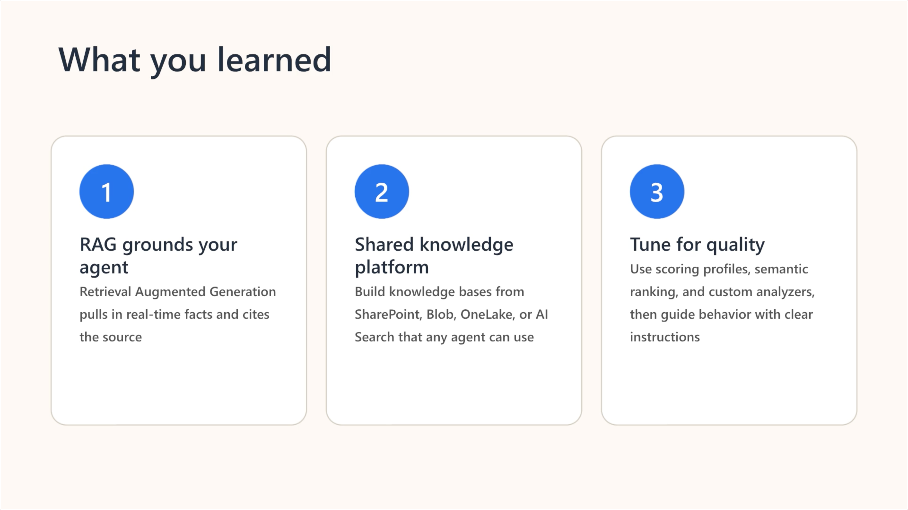

# Build knowledge-enhanced AI agents with Foundry IQ

> **Foundry IQ gives you a single, shared knowledge layer for all your AI agents.**  
Instead of building separate RAG pipelines for every workflow, Foundry IQ centralizes knowledge management so **every agent can tap into the same organizational data**. When you update or improve a knowledge base, all connected agents benefit instantly, making your AI ecosystem more consistent, scalable, and easier to maintain.


### Key points
- Foundry IQ is a managed knowledge platform for AI agents **built on Azure AI Search**. 
- Foundry IQ uses the Model Context Protocol (MCP) to connect agents to knowledge bases.
- When you improve a knowledge base by adding data sources or refining content, every connected agent benefits immediately.

#### RAG delivers three critical advantages for enterprise AI

- **Real-time updates** that keep agents current with policies and procedures without requiring retraining
- **Source transparency** that shows users exactly which documents informed each response to build trust and enable verification
- **Factual grounding** that anchors responses in actual organizational content to eliminate fabricated information and ensure compliance




Building a RAG system from scratch means configuring vector databases, implementing embedding pipelines, tuning retrieval algorithms, and maintaining search infrastructure. What if you need three different AI agents across your organization? You'd build three separate RAG systems.

### Here's what happens when you add a data source

- **Discovery**: Foundry IQ scans your storage location for documents
- **Processing**: Documents are chunked and embedded for semantic search
- **Indexing**: Content becomes searchable through the knowledge base
- **Monitoring**: Changes to your documents trigger automatic reindexing

> **The shared knowledge advantage** - The real value of Foundry IQ emerges when you scale beyond one agent. Imagine your organization needs:

### Connecting agents to knowledge

Super easy to implement - here's the link to the knowledge base as a 'tool'

```python
# Connect to the product documentation knowledge base
knowledge_tool = MCPTool(
    server_label="product-docs",
    server_url=f"{search_endpoint}/knowledgebases/product-documentation/mcp"
)
```
Here's the agent with access to the 'tool' via ```tools=[knowledge_tool]```

```python
# Create an agent with knowledge access
agent = project_client.agents.create_version(
    agent_name="product-support-agent",
    definition=PromptAgentDefinition(
        model="gpt-4o-mini",
        instructions="Answer product questions using the knowledge base. Always cite your sources.",
        tools=[knowledge_tool]
    )
)
```

## Configure data sources for knowledge bases



---

## 🔍 Configure retrieval with Foundry IQ


### Retrieval Behavior Problem 

**Goal:** Enterprise agents must *retrieve, cite, and ground* answers in your knowledge base.

**Three behaviors:**

- **1. Answers from training data** — Generic, wrong, not your policy.  
- **2. Searches but doesn’t cite** — May be correct but **no accountability**.  
- **3. Searches + cites + grounds** — Correct, verifiable, tied to your documents. **Only acceptable behavior.**

**Why it matters:**  
Ungrounded or uncited answers create risk. Enterprise agents must consistently return **grounded, cited, source‑linked** responses.

---

#### Basic retrieval with instructions

A basic approach that produces inconsistent results. This instruction is too vague. "Using the knowledge base" doesn't specify when to use it or how to present results. The agent might search or might not. It might cite sources or might not.

```python
agent = project_client.agents.create_version(
    agent_name="hr-assistant",
    definition=PromptAgentDefinition(
        model="gpt-4o-mini",
        instructions="Answer HR questions using the knowledge base.",
        tools=[knowledge_tool]
    )
)
```
#### Effective retrieval instructions

- **When to retrieve**: Tell the agent to always use the knowledge base, never rely on training data
- **How to cite**: Specify the exact format for source attribution
- **What to do when unsure**: Define fallback behavior when information isn't found

```python
retrieval_instructions = """You are a helpful HR assistant.

CRITICAL RULES:
- You must ALWAYS search the knowledge base before answering any question
- You must NEVER answer from your own knowledge or training data
- Every answer must include citations in this format: 【doc_id:search_id†source_name】
- If the knowledge base doesn't contain the answer, respond with "I don't have that information in our current documentation. Please contact HR directly at hr@company.com"

Your role is to provide accurate, verifiable information from company documentation."""

agent = project_client.agents.create_version(
    agent_name="hr-assistant",
    definition=PromptAgentDefinition(
        model="gpt-4o-mini",
        instructions=retrieval_instructions,
        tools=[knowledge_tool]
    )
)
```

### Testing and Evaulating response quality

Instructions alone aren't enough. You need to verify that agents actually behave as configured. This requires systematic testing with different query types.

```python
    input="How many vacation days do I get?",
```

1. **Straightforward factual** - Direct retrieval + **citations**.
2. **Synthesis questions** → Pull from multiple docs + **multi‑citation** synthesized answer.
3. **Outside knowledge base** → Graceful fallback: *“I don’t have that information…”*
4. **Ambiguous queries** → Ask clarifying questions or run a focused search on the most relevant topic.

#### Evaluating response quality

Good responses demonstrate four characteristics:

1. **Grounding** - Information comes from knowledge base, not training data
2. **Citation** - Every factual claim includes source references
3. **Relevance** - Retrieved content actually answers the question
4. **Completeness** - All necessary information is provided, not just fragments

#### Moving from testing to production

Once your test queries produce consistent, high-quality results, you're ready to deploy. But production introduces new challenges. Track these patterns:

**Citation frequency** - Are agents consistently citing sources?
**Fallback frequency** - How often do agents say "I don't know"?
**Query types** - What categories of questions appear most often?
**Retrieval accuracy** - Do retrieved documents actually contain answers?

You improve retrieval through three key techniques:
1. **Scoring profiles** boost specific fields or attributes to surface more relevant results
2. **Semantic ranking** uses AI models to understand meaning and context beyond keywords
3. **Custom analyzers** handle specialized content like HTML, product codes, or technical terminology

These techniques work together to transform basic search into intelligent retrieval tailored to your content.



---