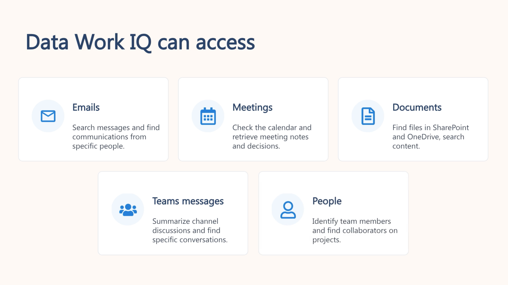
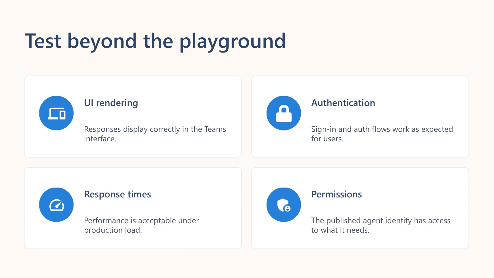

# Integrate your agent with Microsoft 365

- Explain the options for **publishing Foundry agents** to Microsoft 365
- Publish an agent from the Foundry portal to **Teams and Microsoft 365 Copilot**
- Use Work **IQ to access Microsoft 365 data** in your agents
- Test and **troubleshoot agents** integrated with Microsoft 365

---

## Foundry Agent Publishing

- Converts a Foundry agent into a managed Azure resource **with its own endpoint, identity, and governance.**

### **Agent Application**

- Provides a stable invocation URL.  
- Uses a dedicated Entra identity.  
- Ensures user‑level data isolation.  
- Supports version updates without changing the endpoint.

### **Publishing to Microsoft 365**

- Makes the agent available in Teams and Copilot.  
- Creates an Azure Bot Service resource.  
- Generates the M365 publishing package.  
- Registers an Entra app for authentication and discovery.
- Published agents **use a new identity**.  
- Development permissions don’t carry over.  
- Tools (e.g., AI Search) must be re‑permissioned for the published identity.

### **Publishing methods**

- **Foundry portal:** Fast, guided, ideal for agents fully built in Foundry.  
- **M365 Agents Toolkit:** For advanced scenarios (custom SSO, middleware, multi‑environment pipelines).

### **Distribution scopes**

- **Shared:** Immediate availability, no admin approval, best for testing.  
- **Organization:** Tenant‑wide distribution, admin approval required, best for production.
- **Other:** Web preview, Stable API endpoint.  Azure Bot Service channels (Slack, Telegram, Twilio, Facebook, etc.).

### **Prerequisites**

- **Azure AI Project Manager role** on the Foundry project.  
- **Azure AI User role** on the agent application.  
- Ability to create **Bot Service resources and register Entra apps**.  
- M365 **tenant that allows** custom apps/bots.

> The publishing process creates an **Azure Bot Service resource**. **Ensure the Microsoft.BotService provider is registered in your Azure subscription.** You can check this in the Azure portal under your subscription's Resource providers section.

---

## Microsoft Foundry (Beginner integration)

### **1. Publishing steps**

1. Select the agent version in Foundry.  
2. Start publishing → choose “Publish to Teams and Microsoft 365 Copilot.”  
3. Create an Azure Bot Service resource (portal generates App ID + Tenant ID).  
4. Fill in metadata fields.  
5. Choose scope:  
   - **Shared**: immediate availability, best for testing.  
   - **Organization**: requires admin approval, best for production.  
6. Prepare the agent package (1–2 minutes).  
7. Optionally download the package for manual testing.

### **2. Testing in Teams**

- Upload the .zip package via **Apps → Manage your apps → Upload a custom app**.  
- Validate responses, accuracy, latency, and tool functionality.

### **3. Admin approval (organization scope)**

- Admin approves the agent in the Microsoft 365 admin center.  
- Once approved, it appears under “Built by your org” in the Teams store.

### **4. Permissions after publishing**

- Publishing creates a **new agent identity**.  
- Reassign RBAC roles to this identity for any Azure resources the agent uses.  
- Without this, tools may fail even if they worked during development.

### **5. Updating a published agent**

- Make changes → test → republish.  
- Shared scope: upload new package.  
- Organization scope: may require re‑approval depending on policy.  
- Users get the updated version once deployed.

---

## M365 Agents Toolkit (Advanced Integration)

## **Why use the Agents Toolkit**

- **Custom SSO flows**  
- **Middleware** for logging, filtering, message transformation, or custom routing  
- **Multi‑environment pipelines** (dev → test → staging → prod)  
- **Full debugging in VS Code**  
- **CI/CD automation** using GitHub Actions or Azure DevOps  
- **Complex enterprise compliance or integration requirements**

## **How the toolkit works**

You build a **proxy application** that sits between Teams/Copilot and your Foundry agent:

```Teams/Copilot → Proxy App → Foundry Agent```

The proxy handles:

- Authentication  
- Middleware  
- Message routing  
- Custom logic before/after calling the agent  
- Integration with enterprise systems  

## **Development workflow**

1. Install the **Microsoft 365 Agents Toolkit** extension in VS Code.  
2. Create a new **Custom Engine Agent** project.  
3. Configure the agent’s model source and scaffolding.  
4. Connect the proxy to your Foundry agent’s endpoint.  
5. Add middleware or custom logic as needed.  
6. Test locally using the **Agents Playground** (simulated Teams environment).  
7. Deploy the proxy to Azure and register it with Microsoft 365.

---

## Access Microsoft 365 Data with Work IQ



### **Work IQ operates as an **MCP server**, exposing:**

- **Tools** (actions like search)  
- **Resources** (data sources)  
- **Prompts** (predefined query templates)

Agents discover these capabilities and use them to fulfill user requests.

### **Modes of operation**

**CLI mode**  - Run queries directly in the terminal. Useful for development, scripting, and quick checks.

```bash
workiq ask -q "What requirements did Sarah share about the authentication feature?"
```

**MCP server mode**  Integrates with AI assistants (e.g., GitHub Copilot in VS Code). Assistants automatically pull relevant workplace context when needed.

### **Installation options**

- Install via **npm** (global or npx)

```bash
# Global installation
npm install -g @microsoft/workiq

# Or run directly without installation
npx -y @microsoft/workiq mcp
```

- Install as a **GitHub Copilot CLI plugin**  
- Configure as an MCP server in **VS Code** using a JSON block  
- Requires accepting the EULA before first use  

### **Prerequisites**

- Node.js (for local CLI use)  
- Microsoft 365 subscription with Copilot  
- Admin consent for Work IQ in Entra ID (because it accesses org‑wide data)

### **Security model - Work IQ follows Microsoft 365 Copilot’s security rules:**

- Only accesses data the user already has permission to view  
- Does not store data  
- All access is governed by enterprise policies  
- Queries are auditable  
- Uses Microsoft Graph under the user’s identity  

### **Using Work IQ during agent development**

**CLI approach**  - Ideal for quick, ad‑hoc queries. Great for scripts and terminal workflows  
**MCP server approach**  - AI assistants automatically use Work IQ. Provides seamless, context‑aware suggestions in VS Code. Same permissions and data as CLI mode  

> **Status** - Work IQ is currently **in preview**, and features may evolve.

---

## Test and Iterate Your Integrated Agent




## **Common Troubleshooting Scenarios**

| **Issue** | **Likely Cause** | **Fix / Action** |
| --- | --- | --- |
| Agent doesn’t respond in Teams | Bot Service not running; misconfigured Bot Service; package upload issues; network problems | Check Bot Service resource and logs; confirm correct package upload; verify network connectivity |
| Tools work in Foundry but fail in Teams | Published agent identity missing required RBAC permissions | Assign correct Azure RBAC roles to the **published agent identity** |
| Users can’t find the agent | Wrong publish scope; admin approval pending; tenant blocks custom apps | Share direct link (shared scope); verify admin approval (organization scope); confirm tenant allows custom apps |
| Slow response times | Complex instructions; heavy tool queries; network latency | Simplify instructions; optimize tool usage; test from different networks |

## **Monitoring Your Agent**

Use **Foundry metrics** to track:

- Request volume  
- Response times  
- Error rates  
- Tool usage patterns  

If **Application Insights** is enabled, you can:

- Trace conversations  
- Analyze errors  
- Measure end‑to‑end latency  
- Set alerts  

**User Feedback** - Create a feedback channel (Teams or email).  
Review feedback regularly to identify recurring issues and prioritize improvements.

---
