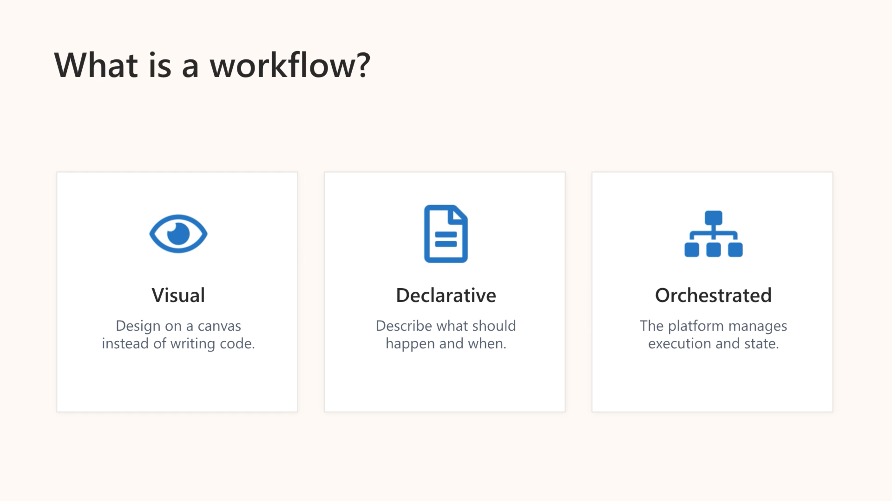
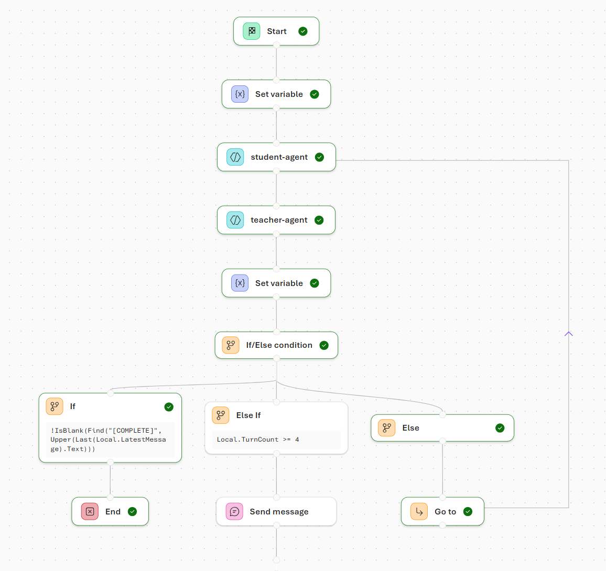
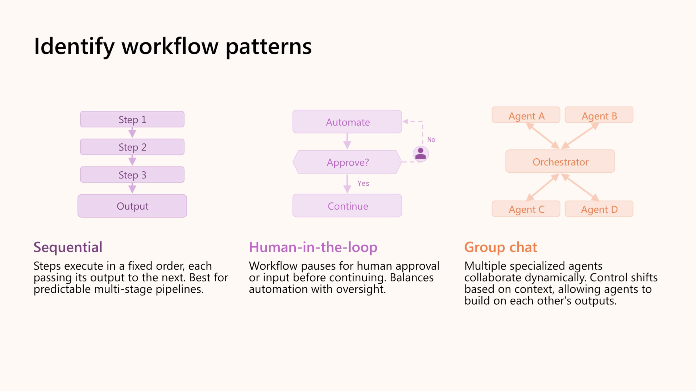
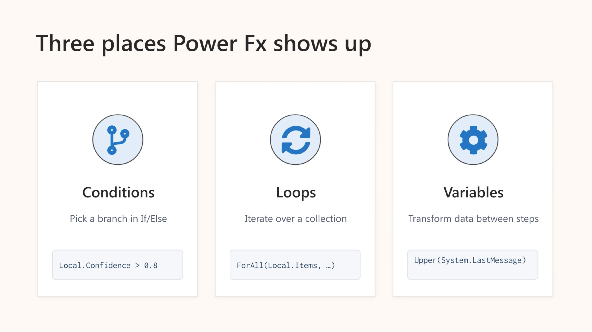
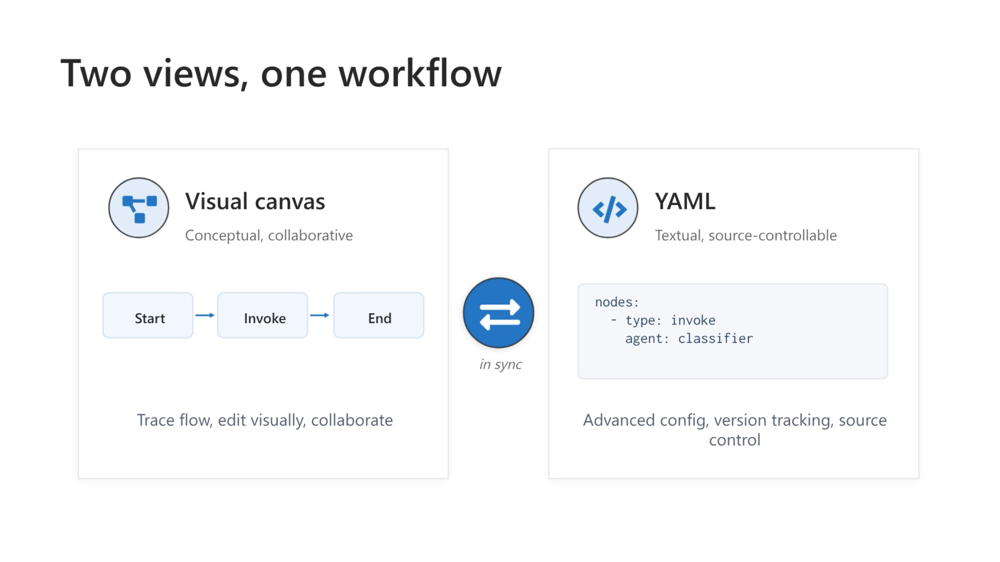
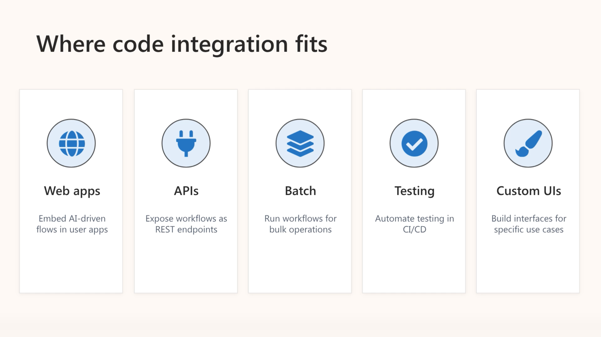

# Build agent-driven workflows using Microsoft Foundry



One of the key advantages of workflows is their ability to coordinate multiple agents. Single-agent solutions often struggle with complex or ambiguous tasks, but workflows allow you to combine agents with different responsibilities—such as classification, decision-making, and resolution—into a cohesive process. This orchestration enables more robust and scalable automation.



Different problems require different orchestration approaches, depending on how decisions are made, how data flows, and whether human input is required. Microsoft Foundry provides several predefined workflow patterns that help you model these interactions clearly and consistently.



## The 5 main node types in the workflow builder

1. **Invoke:** Invokes an AI agent from your project **or creates a new one.** Agent nodes can return free-text responses or structured outputs (like JSON) that other nodes can use. They're used for classification, reasoning, recommendations, or any AI-driven task.

> **Reusability** - Agents can be reused across multiple workflows. This modular design makes workflows easier to maintain and evolve.

2. **Flow:** Controls the workflow's execution path. Flow nodes let your workflow adapt dynamically to different inputs or situations. Flow nodes include:
a. **If/Else:** Branches execution based on conditions.
b. **Go To:** Jumps to another node in the workflow.
c. **For Each:** Loops over a list of items, performing the same actions for each one.
3. **Data transformation:** Manipulates data and manages variables. Data transformation nodes ensure that information is correctly passed to subsequent steps. Data transformation nodes include:
a. **Set Variable:** Assigns a value to a variable for later use.
b. **Reset Variable:** Clears or reinitializes a variable.
c. **Parse value:** Extracts specific data from structured outputs or converts values to different formats.

> **Variables provide shared state across nodes**, allowing outputs from one step—such as agent results or user input—to inform decisions or trigger more actions.

4. **Basic chat:** Sends messages to the user or asks questions to collect input. These nodes are often paired with variables to capture responses, which can then influence logic or agent decisions later in the workflow.
5. **End:** Marks the conclusion of a workflow. The End node can optionally return a final result or status.

> **Variables and control flow** - Variables allow agents to influence decisions, trigger conditional branches, or feed other agents.

## Apply Power Fx in Workflows

**Power Fx is a low‑code, Excel‑style formula language** used to add logic, decisions, and data manipulation inside Foundry workflows. It acts as the “glue” that connects variables, agent outputs, and workflow control.

- You can reference:
  - **System variables** (workflow context, last message, user info)  
  - **Local variables** (data captured or created during workflow execution)



| **Purpose** | **Formula Example** | **Notes** |
| --- | --- | --- |
| Convert text to uppercase | ``Upper(Local.Input)`` | Transforms a string to all caps |
| Convert text to lowercase | ``Lower(Local.Input)`` | Transforms a string to all lowercase |
| Get string length | ``Len(Local.Input)`` | Returns the number of characters in a string |
| Conditional check | ``Local.Confidence ``> ``0.8`` | Returns true/false; used in If/Else nodes |
| If/Else logic | ``If(Local.Confidence ``> ``0.8, ``"Proceed", ``"Escalate")`` | Returns one of two values depending on a condition |
| Sum a list of numbers | ``Sum([10, ``20, ``30])`` | Adds up numbers in a simple list |
| Sum a column in a table | ``Sum(Local.ItemList, ``Amount)`` | Adds up the Amount property of each record in a table |
| Count items in a table or list | ``Count(Local.ItemList)`` | Returns the number of items |
| Check if blank | ``IsBlank(Local.Input)`` | Returns true if variable or input is empty |
| Check if empty table | ``IsEmpty(Local.ItemList)`` | Returns true if a table has no records |
| Loop over items | ``ForAll(Local.ItemList, ``Upper(Name))`` | Applies a formula to each item in a list or table |
| Concatenate text | ``Concatenate(Local.FirstName, ``" ``", ``Local.LastName)`` | Joins multiple strings into one |

---

## Maintain Workflows

Maintaining workflows is about clarity, reliability, and long‑term scalability. Good versioning, documentation, and refinement practices ensure workflows remain strong as your automation grows.



### Using workflows in code

### **Invoking workflows in code**

1. Connect to your Foundry project using **AIProjectClient**.  
2. Create a **conversation context**.  
3. Invoke the workflow by **referencing its name**.  
4. Pass **input text** that the workflow uses to drive logic (e.g., triage a ticket, answer a question, process a payload).

- **Streaming workflow events** - Your app receives **real‑time events** as the workflow runs.  
- You can display progress, capture agent outputs, and react to workflow actions.  Event types include:
  - **Workflow completed**  ```response.completed``` - The workflow finished executing and returned a final response.
  - **Workflow action completed:** ```response.output_item.done``` - An individual output item (such as a workflow action) completed.

You can also choose **non‑streaming mode**, waiting for the final response.

- **Human‑in‑the‑loop workflows** - Some workflows **pause and wait for user input**. Your application can send additional messages to continue execution.

### **Benefits of integrating workflows in code**

- **Web apps** to run agent‑driven logic directly in the UI  
- **APIs/microservices** to expose workflow capabilities  
- **Batch processing** for bulk automation  
- **CI/CD testing** of workflows  
- **Custom interfaces** tailored to workflow behavior


