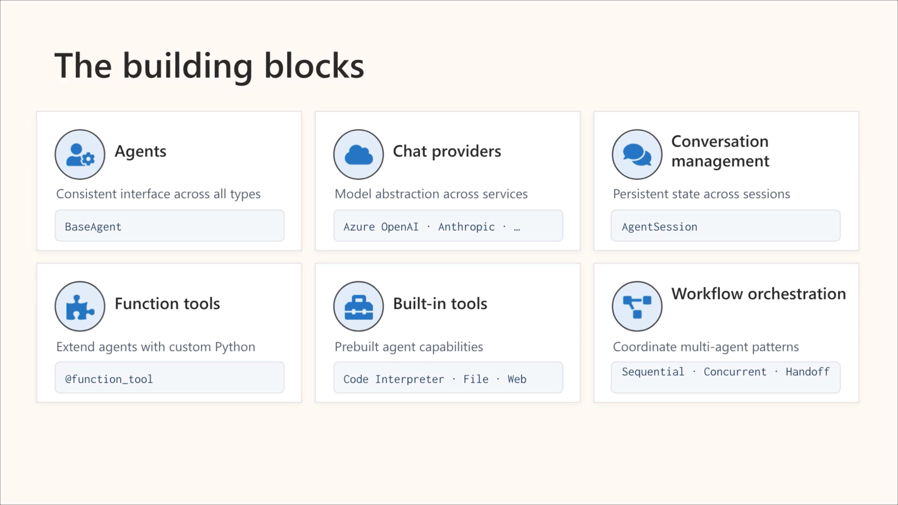
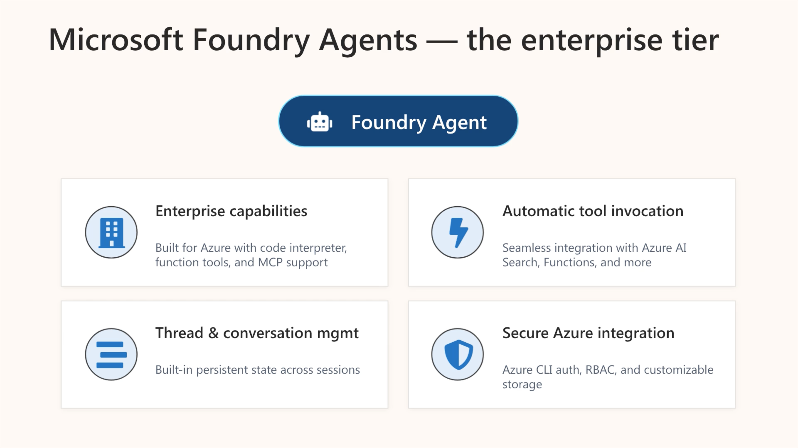
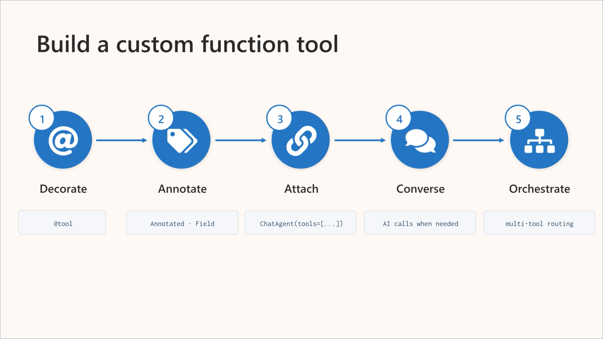

# Develop an AI agent with Microsoft Agent Framework

## Microsoft Agent Framework AI Agents

The Microsoft Agent Framework is the evolution of Semantic Kernel and AutoGen. It merges AutoGen’s intuitive agent abstractions with Semantic Kernel’s enterprise‑grade features such as state management, type safety, filters, and telemetry.

### **Core architecture**
The framework provides a unified **Agent base class**, meaning all agents—regardless of model provider—share the same interface. It bundles memory, tools, model access, and workflows into composable building blocks so you don’t need to stitch separate libraries together.

- **Model clients**: One interface for multiple AI providers  
- **Agent session**: Built‑in state management for multi‑turn conversations  
- **Context providers**: Memory components that surface relevant info  
- **Function tools**: Auto‑registered custom functions with schema generation  
- **MCP clients**: Dynamic tool discovery at runtime  
- **Middleware**: Hooks for logging, interception, and modification  
- **Workflow orchestration**: Graph‑based workflows for sequential, concurrent, group chat, and agent handoff patterns

### **What agents can do**

- Function calling  
- Multi‑turn conversations  
- Structured, type‑safe outputs  
- Streaming responses  
- Provider‑specific built‑in tools (code execution, file search, web search, etc.)

### **Using the framework with Azure AI Foundry**
The framework integrates directly with Azure AI Foundry. With Azure authentication, agents can use Foundry’s capabilities such as:

- Persistent chat history  
- Dynamic tool discovery  
- Azure service integration

### **Why Foundry is recommended**

Foundry provides **service‑side chat history**, meaning conversation state persists automatically across turns. This makes it ideal for production scenarios where maintaining context is essential.

### **Provider flexibility**
You can switch between providers (Foundry, Azure OpenAI, OpenAI, Anthropic, Bedrock, Copilot, Ollama, etc.) without rewriting agent logic—only the client configuration changes.

## Create an Azure AI Agent with Microsoft Agent Framework

### **Why Foundry is the recommended provider**
Foundry Agent Service is the preferred production provider because it handles:
- Persistent conversation history  
- Built‑in tools (code execution, file search)  
- Seamless Azure identity integration  

## **Steps to create a Foundry‑backed agent**

### **1. Set up your Foundry project**
You need:
- A Foundry project  
- A deployed model  
- The project endpoint  
- The model deployment name  

These two identifiers allow your agent to connect to the correct model.

### **2. Configure authentication**
The Agent Framework uses Azure credentials.  
DefaultAzureCredential automatically picks the right identity:
- Azure CLI during development  
- Managed identity in production  

No API keys or connection strings required.

### **3. Initialize the Foundry chat client**
You create a chat client using:
- Credentials  
- Project endpoint  
- Model name  

This client handles authentication, routing, and session management.

### **4. Create the agent**
You define:
- **Instructions** (system prompt describing role + constraints)  
- **Tools** (optional functions the agent can call)  

The framework auto‑registers tools and generates schemas so the model knows how to invoke them.

### **5. Establish a session and interact**
A session stores conversation state.  
You send user messages to the session’s run method, which:
- Processes the prompt  
- Coordinates tool calls  
- Returns the model’s response  

## **Conversation state models**

### **Service‑side history (Foundry)**
- Conversation persists across requests  
- Survives app restarts  
- Ideal for production and multi‑instance scaling

### **Local history (other providers)**
- Stored in memory  
- Suitable for short‑lived or stateless apps  
- Does not persist across restarts

## **Response modes**

### **Non‑streaming**
- Waits for full response  
- Simple and synchronous

### **Streaming**
- Returns partial updates as they’re generated  
- Ideal for user interfaces that benefit from progressive output

Both modes expose a unified `text` property for the final answer.

---

## Add Tools to an Azure AI Agent

### **Why tools matter**
Tools give an agent the ability to **take action**, not just generate text.  
Without tools, an agent can only respond based on its model knowledge.  
With tools, it can execute code, search files, call APIs, query databases, and interact with external systems.

## **Two categories of tools**

### **1. Service‑provided tools (Foundry)**
These are hosted and managed by Foundry. You simply enable them in the agent configuration.

Common service tools include:
- **Code Interpreter** — run Python in a sandbox  
- **File Search** — search uploaded documents  
- **Web Search** — retrieve live internet information  
- **Hosted MCP tools** — invoke MCP servers  
- **Azure AI Search** — query search indexes  
- **Foundry Toolboxes** — versioned bundles of tool configurations  

Some tools are preview/experimental.

### **2. Custom function tools**
You write Python functions and register them as tools.  
The framework inspects the function signature and auto‑generates a schema so the model knows:
- What the tool does  
- What parameters it expects  
- What it returns  

You can describe tools using:
- **Annotated types + docstring**  
- **@tool decorator** (explicit name + description)  
- **Pydantic models** for precise schemas  

The framework handles invocation automatically.

## **Multiple tools**
You can register many tools with one agent.  
The model chooses the right tool based on:
- Conversation context  
- Tool descriptions  
- Parameter definitions  

No routing logic required.

## **Tool approval**
You can require human approval before a tool executes.  
Useful for:
- Irreversible actions  
- Expensive operations  
- Sensitive data access  

Enabled via `approval_mode` on the decorator.

## **Using an agent as a tool**
Agents can be composed:  
One agent becomes a tool for another, enabling modular multi‑agent systems.

## **Best practices**
- Write **clear, specific descriptions**  
- Annotate **every parameter**  
- Return **structured, meaningful data**  
- Keep tools **focused**  
- Handle errors **gracefully**  
