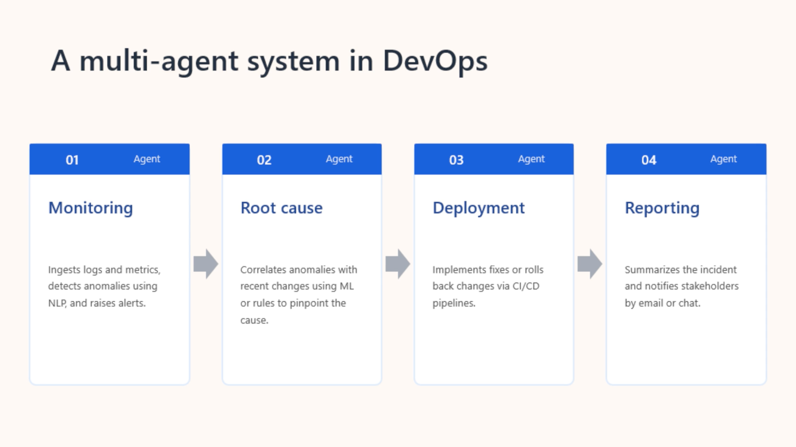

# AI-103 Revision: Multi-Agent Orchestration with Microsoft Agent Framework

**Microsoft Learn module:** Orchestrate a multi-agent solution using the Microsoft Agent Framework  
**Level:** Intermediate  
**Focus:** Building agents and selecting the right multi-agent orchestration pattern.
**Repo:** https://github.com/microsoft/agent-framework

## 1. Microsoft Agent Framework

The **Microsoft Agent Framework (MAF)** is an open-source SDK for building AI agents that can reason, use tools, maintain state, and collaborate in multi-agent solutions.



### Core concepts

| Concept | Meaning |
|---|---|
| **Agent** | Performs a specialised task using an LLM, tools and context |
| **Chat client** | Connects agents to AI model providers |
| **Tools** | Extend agent capabilities through functions/services |
| **AgentSession** | Maintains conversation state/history |
| **Orchestration** | Controls how multiple agents collaborate |

**Mental model:**

> Agents = workers  
> Orchestration = how the workers cooperate

---

## 2. Agent Orchestration

MAF workflows can be built from:

- **Executors** - perform work
- **Edges** - control message flow
- **Events** - provide workflow status and observability

### Edge types

| Edge | Purpose |
|---|---|
| **Direct** | A → B |
| **Conditional** | A → B when a condition is true |
| **Switch-case** | Select one route from alternatives |
| **Fan-out** | One input → multiple executors |
| **Fan-in** | Multiple outputs → one executor |

### Typical workflow

**Define agents → choose orchestration → configure → build/runtime → invoke → retrieve results**

---

# 3. Concurrent Orchestration

### Mental model

**Everyone works at the same time.**

```text
              ┌─ Agent A ─┐
Input ────────┼─ Agent B ─┼──→ Results
              └─ Agent C ─┘
```

Each agent receives the task independently.

### Best for

- Independent analysis
- Brainstorming
- Multiple perspectives
- Voting/consensus
- Parallel processing

### Avoid when

- Agents depend on previous results
- Strict ordering is required
- Shared resources could conflict

**Exam clue:**  
> "Run several agents at the same time" = **Concurrent**

---

# 4. Sequential Orchestration

### Mental model

**A pipeline.**

```text
Agent A → Agent B → Agent C → Final result
```

The output from one agent becomes input to the next.

### Best for

- Document processing
- Data transformation
- Draft → review → polish
- Multi-stage reasoning
- Predictable workflows

**Exam clue:**  
> "Each agent builds on the previous agent's output" = **Sequential**

---

# 5. Group Chat Orchestration

### Mental model

**A managed discussion.**

```text
             ┌─ Agent A
             │
Chat Manager ├─ Agent B
             │
             └─ Agent C
```

A **chat manager** controls the conversation and determines who speaks next. Human participation can also be included.

### Best for

- Brainstorming
- Debate
- Consensus
- Collaborative problem solving
- Human-in-the-loop scenarios
- Maker/checker workflows

### Custom GroupChatManager can control

1. Whether user input is required
2. Whether the conversation should terminate
3. Which results are filtered
4. Which agent speaks next

**Exam clue:**  
> "Agents discuss/debate and a manager controls who speaks next" = **Group Chat**

---

# 6. Handoff Orchestration

### Mental model

**The current agent decides who should take over.**

```text
User
 ↓
Agent A
 ↓ "Needs specialist"
Agent B
 ↓
Agent C
```

The next agent is not necessarily predetermined.

### Best for

- Customer support
- Expert routing
- Escalation
- Dynamic specialist selection

### Key distinction

**Sequential:** the workflow defines the order.

**Handoff:** an agent dynamically transfers control to another agent.

**Exam clue:**  
> "The agent decides which specialist should handle the next step" = **Handoff**

---

# 7. Magentic Orchestration

### Mental model

**A manager figures out the plan as it goes.**

```text
                 ┌─ Agent A
                 │
Task → Manager ──┼─ Agent B
                 │
                 └─ Agent C
                       ↓
                 Refine / repeat
```

Magentic is designed for **complex, open-ended problems where the solution path is not known beforehand**.

The manager can:

- Plan
- Delegate
- Track progress
- Maintain shared context
- Adapt/replan
- Coordinate agents
- Synthesise the final result

### Task ledger

The **task ledger** tracks goals, subgoals and the evolving execution plan.

### Best for

- Complex research
- Open-ended problems
- Dynamic planning
- Multiple specialised agents
- Iterative refinement

**Exam clue:**  
> "Complex problem + manager dynamically plans, delegates and replans" = **Magentic**

---

# ⭐ The Five Patterns - Memorise This

| Pattern | Mental model | Use when... |
|---|---|---|
| **Concurrent** | 🏃 Everyone at once | Independent tasks / perspectives |
| **Sequential** | ➡️ Pipeline | Fixed steps; each builds on previous |
| **Group Chat** | 💬 Discussion | Debate / collaboration |
| **Handoff** | 🔀 Pass the baton | Dynamic specialist routing |
| **Magentic** | 🧠 Manager plans | Complex, open-ended, evolving problems |

## Exam decision tree

```text
Can agents work independently?
        │
       YES
        ↓
   CONCURRENT

Does each step depend on the previous?
        │
       YES
        ↓
   SEQUENTIAL

Do agents need to discuss/debate?
        │
       YES
        ↓
   GROUP CHAT

Does control need to move dynamically
between specialists?
        │
       YES
        ↓
     HANDOFF

Is the problem open-ended and does
the system need to plan/replan?
        │
       YES
        ↓
    MAGENTIC
```

---

# 8. Exercise: Multi-Agent Solution

The practical exercise demonstrates a multi-agent solution for **incident triage and resolution**.

The scenario uses specialised agents such as:

- **Incident Manager Agent**
- **DevOps Agent**

They collaborate to analyse logs, triage incidents and resolve issues.

### Core architecture

```text
Problem
   ↓
Specialised agents
   ↓
Orchestration
   ↓
Collaboration
   ↓
Resolution
```

The exercise is primarily about applying the orchestration concepts in an actual multi-agent application.

---

# 🧠 AI-103 Exam Cheat Sheet

### Know these distinctions cold

**Concurrent**  
> Same task → many agents simultaneously.

**Sequential**  
> Agent A → Agent B → Agent C.

**Group Chat**  
> Agents converse; manager controls who speaks.

**Handoff**  
> Agent dynamically transfers control to another specialist.

**Magentic**  
> Manager dynamically plans, delegates and adapts.

### Other terms to know

- **Executor** = performs work
- **Edge** = controls message flow
- **Fan-out** = one → many
- **Fan-in** = many → one
- **Conditional edge** = route based on a condition
- **Switch-case** = select a route from alternatives
- **AgentSession** = conversation state
- **Workflow events** = observability/debugging
- **Task ledger** = Magentic's evolving plan/progress record
- **Chat manager** = controls Group Chat
- **Orchestration** = coordinates multiple agents

---

# One-Minute Revision

> **MAF lets specialised AI agents collaborate.**

Remember the five patterns:

**Concurrent = parallel**  
**Sequential = pipeline**  
**Group Chat = discussion**  
**Handoff = dynamic routing**  
**Magentic = dynamic planning**

And the core workflow concepts:

**Agents + Executors + Edges + Runtime + Events**

## The one question to ask

When you see an exam scenario, ask:

> **"How does control move between the agents?"**

- **At the same time?** → Concurrent
- **Fixed sequence?** → Sequential
- **Conversation/debate?** → Group Chat
- **Agent chooses the next specialist?** → Handoff
- **Manager plans and replans?** → Magentic

---

## Source

Microsoft Learn: [Orchestrate a multi-agent solution using the Microsoft Agent Framework](https://learn.microsoft.com/en-us/training/modules/orchestrate-semantic-kernel-multi-agent-solution/)
