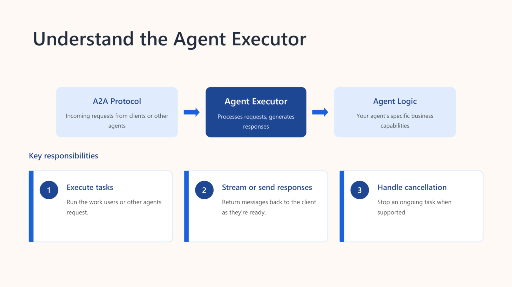
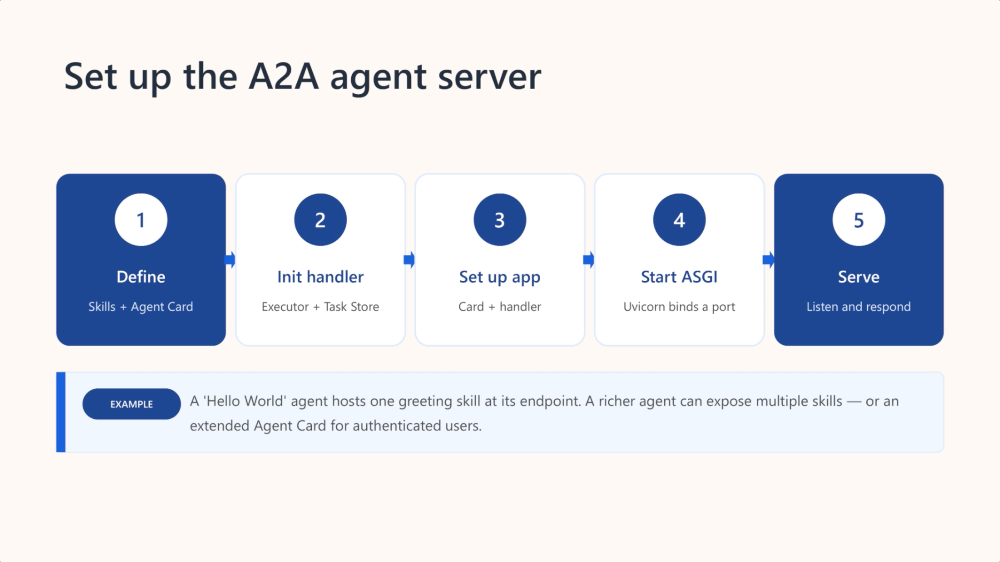

# Azure AI Agents with A2A

- Understand the A2A protocol and its role in multi-agent orchestration.
- Design discoverable agents for modular, collaborative problem-solving.
- Implement A2A strategies to discover and invoke remote agents.

The Agent-to-Agent (A2A) protocol addresses this challenge by providing a standardized framework for agent discovery, communication, and coordinated task execution. By implementing A2A, you can easily manage connections to remote agents, delegate requests to the appropriate agent, and enable seamless, standardized, and secure communication between agents.

**Multi-agent orchestration** = how you coordinate agents.
**A2A = how agents communicate** across boundaries.

> **NOTE: A2A is to agents what MCP is to tools.**

A2A is a **standard communication protocol** that lets AI agents from different vendors or platforms collaborate. It provides shared context, secure capability invocation, and integrated authentication so agents can work together reliably.

An **Agent Skill** is a clearly defined capability the agent can perform. Each skill includes:

- ID  
- Name  
- Description  
- Tags  
- Examples  
- Supported input/output formats  

Skills act as the building blocks that other agents or clients can discover and invoke.

The **Agent Card** is the agent’s “digital business card.” It describes:

- Identity (name, description, version)  
- Endpoint URL  
- Supported A2A features (e.g., streaming)  
- Default input/output modes  
- Full list of skills  
- Authentication requirements  

Routing agents use the card to understand what the agent can do and how to interact with it.

### 🔹 Putting It All Together

Once an agent defines its skills and publishes its Agent Card:

- Other agents can automatically discover it  
- Requests can be routed to the correct skill  
- Responses flow in supported formats  
- Multi‑agent workflows become possible (e.g., one agent generates a title, another generates an outline)



### 🔹 What the Agent Executor Does

- Receives every incoming request sent to the agent
- Processes the request using the agent’s capabilities and business logic
- Sends responses or streamed events back through an event queue
- Supports cancellation when the agent implements it (optional)

### 🔹 Core Operations  
**Execute**  
- Reads request details (user input, context)
- Runs the agent’s logic  
- Wraps the result into an event and pushes it to the event queue

**Cancel**  
- Handles cancellation requests if the agent supports them  
- Simple agents may just return “cancellation not supported”

### 🔹 Request Flow Example (“Hello World” Agent)  
1. Executor receives a request
2. Calls the agent’s helper logic to produce output 
3. Wraps the output as an event and queues it for return
4. Routing sends the event back to the requester

### 🔹 Why It Matters  
The Agent Executor is the **bridge** between the A2A protocol and your agent’s actual functionality. It ensures consistent request handling, response streaming, and integration with multi‑agent workflows.



Exposed at a standard endpoint (typically ```/.well-known/agent-card.json```) so clients and other agents can discover your agent.

### 🔹 What the client does  
- Acts as the **bridge** between your application and the agent server  
- **Discovers the Agent Card**, which contains the agent’s metadata and endpoints  
- **Sends requests** (streaming or non‑streaming)  
- **Receives and interprets responses**, including direct messages or task objects  

### 🔹 Connecting to the agent  
- The client needs the **base URL** of the agent server  
- It retrieves the **Agent Card** from a well‑known endpoint  
- Once loaded, the client is initialized and ready to send messages  

### 🔹 Sending requests  
Two request types:

- **Non‑streaming**  
  - Client sends a message  
  - Waits for a full, single response  
  - Best for simple interactions  

- **Streaming**  
  - Client receives partial responses as the agent processes  
  - Ideal for long‑running tasks or real‑time updates  

Requests include a **role** (like `user`) and **content**.  
Advanced agents may return **task objects** instead of immediate messages.

### 🔹 Handling responses
Clients must handle:

- **Direct messages** — immediate text or structured output  
- **Task-based responses** — objects representing ongoing work requiring follow‑up  

Streaming responses are **asynchronous** and may arrive incrementally.
### 🔹 Key idea  
Connecting a client to an A2A agent involves:

1. Fetching the Agent Card  
2. Initializing the client  
3. Sending requests  
4. Handling direct or task-based responses  

This enables everything from simple message exchanges to complex, multi-step task management.
