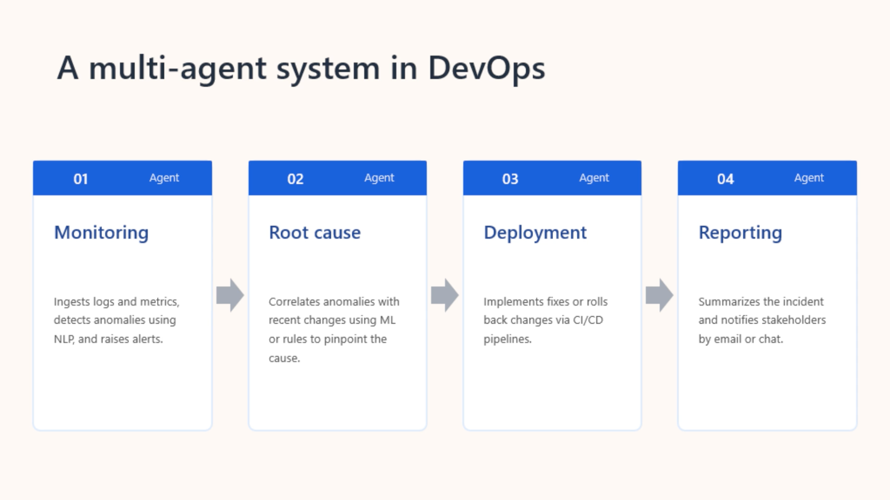

# Orchestrate a multi-agent solution using the Microsoft Agent Framework

## 🎯 Key points

> **MAF lets specialised AI agents collaborate.**
> 
## ⭐ The Five Patterns - Memorise This

| Pattern | Mental model | Use when... |
|---|---|---|
| ```ConcurrentBuilder``` | 🏃 Everyone at once | Independent tasks / perspectives |
| ```SequentialBuilder``` | ➡️ Pipeline | Fixed steps; each builds on previous ```run_stream``` |
| ```GroupChatBuilder``` | 💬 Discussion (can inc. Human) | Debate / collaboration '**maker-checker loop**' ```GroupChatManager```+ ```select_next_agent``` |
| **Handoff** | 🔀 Pass the baton | Dynamic specialist routing |
| ```MagenticBuilder``` | 🧠 Manager plans | Complex, open-ended, evolving problem, ```Task ledger```

- **Executors** - perform work
- **Edges** - control message flow
  - **Direct** | A → B → C
  - **Conditional** | A → B when a condition is true
  - **Switch-case** | Select one route from alternatives
  - **Fan-out** | One input → multiple executors
  - **Fan-in** | Multiple outputs → one executor
- **Events** - provide workflow status and observability and debugging during workflow execution
  - **WorkflowStartedEvent** - Triggered when workflow execution begins.
  - **WorkflowOutputEvent**- Emitted when the workflow produces an output.
  - **WorkflowErrorEvent** - Occurs when an error is encountered.
  - **ExecutorInvokeEvent** - Fired when an executor starts processing a task.
  - **ExecutorCompleteEvent** - Fired when an executor finishes its work.
  - **RequestInfoEvent** - Logged when an external request is issued.

**Other terms to know**
- **AgentSession** = conversation state
- **Workflow events** = observability/debugging
- **Task ledger** = Magentic's evolving plan/progress record
- **Chat manager** = controls Group Chat
- **Orchestration** = coordinates multiple agents

### Group chat manager call order

During each round of the conversation, the chat manager calls methods in this order:

- ```should_request_user_input``` - Checks if human input is needed before the next agent responds.
- ```should_terminate``` - Determines if the conversation should end (for example, max rounds reached).
- ```filter_results``` - If ending, summarizes or processes the final conversation.
- ```select_next_agent``` - If continuing, chooses the next agent to speak.

## Implement xx orchestation

1. Create your chat client - ```AzureOpenAIChatClient)```
2. Define your agents - ```create_agent```
3. Build the xx workflow - ```ConcurrentBuilder, SequentialBuilder, GroupChatBuilder, MagenticBuilder  ...participants() & build()```
4. Run the workflow - ```run``` OR ```run_stream```
5. Process the worklfow - ```get_outputs()``` OR ```WorkflowOutputEvent```
6. Extract the final conversation - final conversation contains the complete conversation history showing how each agent in the sequence contributed to the final outcome.

### Typical workflow

**Define agents → choose orchestration → configure → build/runtime → invoke → retrieve results**

---

## 1. Microsoft Agent Framework (MAF)

The **Microsoft Agent Framework (MAF)** is an open-source SDK for building AI agents that can reason, use tools, maintain state, and collaborate in multi-agent solutions.



### Core concepts

| Concept | Meaning |
|---|---|
| **Agent** | Performs a specialised task using an LLM, tools and context |
| **Chat client** | Connects agents to AI model providers |
| **Tools** | Extend agent capabilities through functions/services |
| **AgentSession** | Maintains conversation state/history |
| **Orchestration** | Controls how multiple agents collaborate |

**Mental model:**

> Agents = workers  
> Orchestration = how the workers cooperate

---

## 2. Agent Orchestration

MAF workflows can be built from:

- **Executors** - perform work
- **Edges** - control message flow
- **Events** - provide workflow status and observability

### Edge types

| Edge | Purpose |
|---|---|
| **Direct** | A → B |
| **Conditional** | A → B when a condition is true |
| **Switch-case** | Select one route from alternatives |
| **Fan-out** | One input → multiple executors |
| **Fan-in** | Multiple outputs → one executor |

### Typical workflow

**Define agents → choose orchestration → configure → build/runtime → invoke → retrieve results**

---

# 3. Concurrent Orchestration

### Mental model

**Everyone works at the same time.**

```text
              ┌─ Agent A ─┐
Input ────────┼─ Agent B ─┼──→ Results
              └─ Agent C ─┘
```

Each agent receives the task independently.

### Best for

- Independent analysis
- Brainstorming
- Multiple perspectives
- Voting/consensus
- Parallel processing

### Avoid when

- Agents depend on previous results
- Strict ordering is required
- Shared resources could conflict

**Exam clue:**  
> "Run several agents at the same time" = **Concurrent**

---

# 4. Sequential Orchestration

### Mental model

**A pipeline.**

```text
Agent A → Agent B → Agent C → Final result
```

The output from one agent becomes input to the next.

### Best for

- Document processing
- Data transformation
- Draft → review → polish
- Multi-stage reasoning
- Predictable workflows

**Exam clue:**  
> "Each agent builds on the previous agent's output" = **Sequential**

---

# 5. Group Chat Orchestration

### Mental model

**A managed discussion.**

```text
             ┌─ Agent A
             │
Chat Manager ├─ Agent B
             │
             └─ Agent C
```

A **chat manager** controls the conversation and determines who speaks next. Human participation can also be included.

### Best for

- Brainstorming
- Debate
- Consensus
- Collaborative problem solving
- Human-in-the-loop scenarios
- Maker/checker workflows

### Custom GroupChatManager can control

1. Whether user input is required
2. Whether the conversation should terminate
3. Which results are filtered
4. Which agent speaks next

**Exam clue:**  
> "Agents discuss/debate and a manager controls who speaks next" = **Group Chat**

---

# 6. Handoff Orchestration

### Mental model

**The current agent decides who should take over.**

```text
User
 ↓
Agent A
 ↓ "Needs specialist"
Agent B
 ↓
Agent C
```

The next agent is not necessarily predetermined.

### Best for

- Customer support
- Expert routing
- Escalation
- Dynamic specialist selection

### Key distinction

**Sequential:** the workflow defines the order.

**Handoff:** an agent dynamically transfers control to another agent.

**Exam clue:**  
> "The agent decides which specialist should handle the next step" = **Handoff**

---

# 7. Magentic Orchestration

### Mental model

**A manager figures out the plan as it goes.**

```text
                 ┌─ Agent A
                 │
Task → Manager ──┼─ Agent B
                 │
                 └─ Agent C
                       ↓
                 Refine / repeat
```

Magentic is designed for **complex, open-ended problems where the solution path is not known beforehand**.

The manager can:

- Plan
- Delegate
- Track progress
- Maintain shared context
- Adapt/replan
- Coordinate agents
- Synthesise the final result

### Task ledger

The **task ledger** tracks goals, subgoals and the evolving execution plan.

### Best for

- Complex research
- Open-ended problems
- Dynamic planning
- Multiple specialised agents
- Iterative refinement

**Exam clue:**  
> "Complex problem + manager dynamically plans, delegates and replans" = **Magentic**
