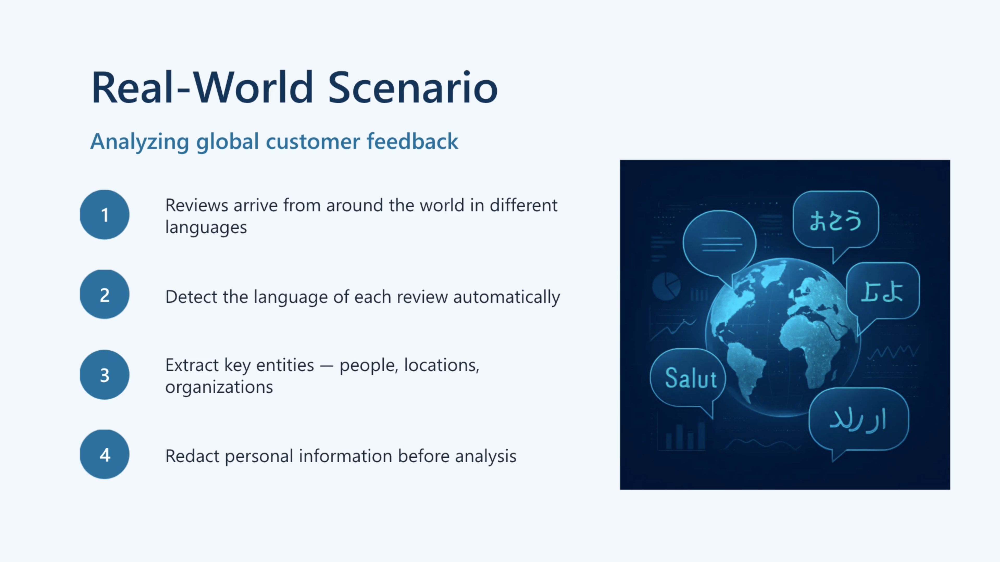

# Text analysis agent with Azure Language MCP Server



**Model Context Protocol (MCP)** is an open protocol that lets AI agents interact with external **tools, data sources and services**.

MCP uses a **client-server architecture**:

| Component  | Role                                                  |
| ---------- | ----------------------------------------------------- |
| **Host**   | Application running the agent, e.g. Microsoft Foundry |
| **Client** | Connects the host/agent to MCP servers                |
| **Server** | Exposes tools, resources and prompts to the agent     |

The important concept is **dynamic tool discovery**. The agent asks the MCP server what tools are available and can then choose the appropriate one at runtime.

### 🧠 Why MCP matters

Without MCP, you'd typically need to build routing logic into your agent:

> "If user asks about language → call language detection API."

With MCP:

> **Agent discovers available tools → model chooses the appropriate tool.**

Tools can be added, changed or removed on the server without modifying the agent. Less hardcoded plumbing, which is presumably why humans invented another acronym.

## Azure Language MCP capabilities

The Azure Language MCP server exposes Azure Language functionality as **MCP tools**:

| Tool                               | Purpose                                                               |
| ---------------------------------- | --------------------------------------------------------------------- |
| **Language Detection**             | Identifies the language                                               |
| **Named Entity Recognition (NER)** | Finds and categorizes entities                                        |
| **PII Redaction**                  | Detects and redacts personal information                              |
| **Text Analytics for Health**      | Extracts medical entities such as diagnoses, medications and symptoms |

The agent can call **multiple tools in the same turn** when the request requires it. ([Microsoft Learn][1])

### 🔄 Tool-selection flow

Memorise this sequence:

**1. User prompt**
↓
**2. Agent understands the task**
↓
**3. Agent examines available MCP tools**
↓
**4. Model selects appropriate tool(s)**
↓
**5. MCP server calls Azure Language capability**
↓
**6. Results returned to agent**
↓
**7. Agent produces response**

The key exam point: **you don't need to write the routing logic yourself.** The agent selects tools based on their descriptions.

## 🌐 Azure Language MCP endpoint

Remote MCP endpoint format:

```text
https://{foundry-resource-name}.cognitiveservices.azure.com/language/mcp?api-version=2025-11-15-preview
```

There is also a **local MCP server** that can be hosted in your own environment.

## 🧠 Revision snapshot

> **MCP = standard way for agents to discover and use external tools**
>
> **Host** → runs agent
> **Client** → manages MCP connection
> **Server** → exposes tools
> **Dynamic discovery** → agent discovers tools at runtime
> **Azure Language MCP** → Language Detection, NER, PII Redaction, Health
> **Agent chooses tools** → no hardcoded routing required
> **Multiple tools** → can be called for one user request

### ⚠️ Exam traps

* **MCP is not the AI model.** It is the protocol connecting the agent to tools.
* **MCP server exposes capabilities.**
* **MCP client manages communication.**
* **The agent/model decides which tool to use.**
* **Dynamic discovery** means tools don't have to be hardcoded into the agent.

---

# Connect & Use Language MCP

### 🔑 The basic process

To use the **Azure Language MCP server with an agent**:


## 1. Create the agent

1. Create/use a Foundry project.
2. Deploy a model, such as GPT-4.1.
3. Create an agent.
4. Give the agent instructions describing its purpose.

```text
You are an AI agent that assists users by helping them analyze text.
```

## 2. Connect Azure Language MCP

In the agent's **Tools** page:

1. Select **Connect a tool**
2. Choose **Azure Language in Foundry Tools**
3. Configure:

   * **Foundry resource name**
   * **Authentication:** Key-based
   * **Credential:** `Ocp-Apim-Subscription-Key`
4. Connect it to the agent.

The agent can then access the text-analysis tools exposed by the MCP server.

### Important

Update the agent instructions to tell it to use the tool:

```text
Use the Azure Language tool to perform text analysis tasks.
```

## 3. Test in Agent Playground

When you submit a text-analysis request, the agent:

1. Identifies the required task(s)
2. Selects the appropriate MCP tool(s)
3. Calls the tools
4. Combines the results into its response

The **first MCP tool call requires approval**.

The **Logs** pane lets you inspect:

* Tool called
* Input
* Result

Useful for debugging. Because apparently even agents need receipts. 🧾


## 💻 Using the agent programmatically

The **Microsoft Foundry SDK** supports calling the agent through the **OpenAI Responses API**.

Key packages:

```bash
pip install azure-ai-projects azure-identity
```

General flow:

```text
AIProjectClient
      ↓
get_openai_client()
      ↓
responses.create()
      ↓
agent_reference
      ↓
Agent + MCP tools
      ↓
response.output_text
```

The important bit is referencing the agent:

```python
extra_body={
    "agent_reference": {
        "name": "Text-Analysis-Agent",
        "type": "agent_reference"
    }
}
```

You can inspect the complete response to see the MCP tools called and their inputs/results.

## 🔧 Connect MCP in code

Instead of configuring MCP through the Foundry portal, you can define it using `MCPTool`:

```python
from azure.ai.projects.models import MCPTool

mcp_tool = MCPTool(
    server_label="azure-language",
    server_url="https://{foundry-resource-name}.cognitiveservices.azure.com/language/mcp?api-version=2025-11-15-preview",
    require_approval="always",
)
```

### `allowed_tools`

You can restrict the agent to **specific Language tools** using:

```text
allowed_tools
```

This is important for **controlling what the agent is permitted to call**.

---

## 🧠 Multi-task prompts

An agent can use **multiple MCP tools in one turn**.

For example:

> "Find the entities and dates in this review and tell me whether it's positive or negative."

The agent determines that it needs multiple text-analysis capabilities, calls the relevant tools independently, then **synthesizes the results** into one response.

---

## 📝 Revision snapshot

> **Portal:**
> Foundry → Tools → Azure Language → Connect → Use in agent
>
> **Agent:**
> Instructions tell it when to use Azure Language.
>
> **Playground:**
> Test + approve tools + inspect Logs.
>
> **Code:**
> `AIProjectClient` → `get_openai_client()` → `responses.create()`
>
> **Agent reference:**
> `extra_body.agent_reference`
>
> **Programmatic MCP:**
> `MCPTool`
>
> **Security/control:**
> `require_approval` + `allowed_tools`
>
> **Multi-task:**
> Agent can call multiple MCP tools and combine their results.

### ⚠️ Exam focus

**Know the difference between:**

* **Connecting MCP in Foundry** → portal configuration
* **Connecting MCP in code** → `MCPTool`
* **Calling the agent** → Responses API + `agent_reference`
* **Controlling tools** → `allowed_tools`
* **Approving tool use** → `require_approval`
* **Observing tool execution** → Playground **Logs**

---
