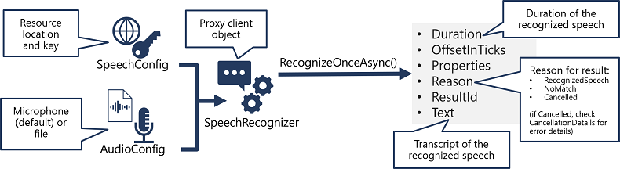
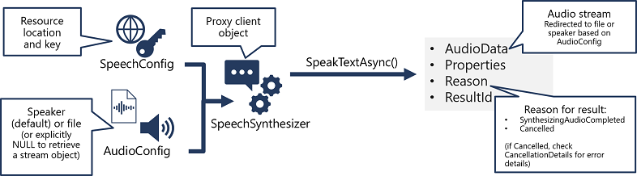

# Create speech-enabled apps with Azure Speech in Microsoft Foundry Tools

Use **Azure Speech in Microsoft Foundry Tools** to build applications that can **recognize speech, synthesize speech, control audio output and customize voices using SSML**.

## 1. Azure Speech in Foundry Tools

Azure Speech in Foundry Tools provides APIs that you can use to build speech-enabled applications, including:

| Capability             | Purpose                               |
| ---------------------- | ------------------------------------- |
| **Speech to Text**     | Speech → text                         |
| **Text to Speech**     | Text → spoken audio                   |
| **Speech Translation** | Spoken language → translated language |
| **Voice Live**         | Real-time conversational AI           |

- Creating an application to transcribe recorded calls or meetings.
- Creating an AI assistant that can read text messages or emails aloud.

### Azure resource

You need a **Microsoft Foundry resource** containing Azure Speech capabilities.

The Python SDK is:

```bash
pip install azure-cognitiveservices-speech
```

Create a `SpeechConfig`:

```python
import azure.cognitiveservices.speech as speech_sdk

speech_config = speech_sdk.SpeechConfig(
    subscription="YOUR_FOUNDRY_KEY",
    endpoint="YOUR_FOUNDRY_ENDPOINT"
)
```

**SpeechConfig = connection information** It contains the **endpoint and key** needed to access the Speech service.

## 2. Speech to Text



Speech recognition follows this pattern:

```text
SpeechConfig
     ↓
AudioConfig
     ↓
SpeechRecognizer
     ↓
Speech-to-Text API
     ↓
SpeechRecognitionResult
```

### Objects

| Object                    | Purpose                     |
| ------------------------- | --------------------------- |
| `SpeechConfig`            | Connects to Speech resource |
| `AudioConfig`             | Specifies audio input       |
| `SpeechRecognizer`        | Performs recognition        |
| `SpeechRecognitionResult` | Contains result             |

`AudioConfig` can use:

* Default microphone
* Audio file

Example:

```python
audio_config = speech_sdk.audio.AudioConfig(
    filename="audio.wav"
)

speech_recognizer = speech_sdk.SpeechRecognizer(
    speech_config=speech_config,
    audio_config=audio_config
)

result = speech_recognizer.recognize_once_async().get()
```

### Result states

**`RecognizedSpeech`**
→ Speech successfully converted to text.

**`NoMatch`**
→ Audio was processed but no speech was recognized.

**`Canceled`**
→ Something went wrong. Check the cancellation details.

### ⚠️ Exam trap

If the question asks:

> "Which object specifies the audio file?"

Answer:

**`AudioConfig`**

Not `SpeechConfig`, and not `SpeechRecognizer`.

---

## 3. Text to Speech



Reverse the process:

```text
Text
 ↓
SpeechConfig
 ↓
AudioConfig
 ↓
SpeechSynthesizer
 ↓
Text-to-Speech API
 ↓
Audio
```

### Objects

| Object                  | Purpose                              |
| ----------------------- | ------------------------------------ |
| `SpeechConfig`          | Connection + synthesis configuration |
| `AudioConfig`           | Specifies where audio goes           |
| `SpeechSynthesizer`     | Converts text to speech              |
| `SpeechSynthesisResult` | Contains generated audio/result      |

Example:

```python
audio_config = speech_sdk.audio.AudioOutputConfig(
    use_default_speaker=True
)

speech_synthesizer = speech_sdk.SpeechSynthesizer(
    speech_config=speech_config,
    audio_config=audio_config
)

result = speech_synthesizer.speak_text_async(
    "Hello"
).get()
```

### Output destinations

Audio can be:

* Played through the default speaker
* Written to an audio file
* Returned as an audio stream

### Successful result

`Reason` is:

```text
SynthesizingAudioCompleted
```

The generated audio is available through:

```text
AudioData
```

## 4. Configure Audio Format & Voices

You can customise the **format** of synthesized audio.

Important characteristics include:

* File/audio type
* Sample rate
* Bit depth

Example:

```python
speech_config.set_speech_synthesis_output_format(
    SpeechSynthesisOutputFormat.Riff24Khz16BitMonoPcm
)
```

### Voices

Azure Speech provides many neural voices.

You specify one using:

```python
speech_config.speech_synthesis_voice_name = \
    "en-US-Brian:DragonHDLatestNeural"
```

### 🧠 Remember

**Audio format** controls the characteristics of the generated audio.

**Voice name** controls **who/how it sounds**.

## 5. Speech Synthesis Markup Language (SSML)

**SSML** is XML-based markup that gives you much finer control over synthesized speech.

It can control:

* 🗣️ Speaking style
* ⏸️ Pauses
* 🔤 Pronunciation/phonemes
* 🎵 Prosody
* 📅 How dates, times and numbers are spoken
* 🔊 Embedded audio
* 👥 Multiple voices

### Particularly important

**Prosody** controls characteristics such as:

* Pitch
* Speaking rate
* Voice characteristics

You can also use **phonemes** when you need a specific pronunciation.

For example, making an acronym or unusual word pronounce the way you intend.

### Python

```python
result = speech_synthesizer.speak_ssml_async(
    "<speak>...</speak>"
).get()
```

### 🧠 SSML memory hook

> **SSML = control HOW the words are spoken, not just WHAT is spoken.**

## 🧠 AI-103 Revision Snapshot

```text
             AZURE SPEECH
                  │
        ┌─────────┴─────────┐
        ↓                   ↓
   SPEECH → TEXT        TEXT → SPEECH
        │                   │
 SpeechRecognizer    SpeechSynthesizer
        │                   │
   AudioConfig         AudioConfig
        │                   │
        └──── SpeechConfig ─┘
              │
        Endpoint + Key
```

### Memorise these

| Concept                 | Answer                                 |
| ----------------------- | -------------------------------------- |
| Connect to resource     | `SpeechConfig`                         |
| Authentication          | **Endpoint + key**                     |
| Audio input             | `AudioConfig`                          |
| Speech recognition      | `SpeechRecognizer`                     |
| Speech → text           | `recognize_once_async()`               |
| Text synthesis          | `SpeechSynthesizer`                    |
| Text → speech           | `speak_text_async()`                   |
| Change voice            | `speech_synthesis_voice_name`          |
| Change audio format     | `set_speech_synthesis_output_format()` |
| Advanced speech control | **SSML**                               |
| SSML API                | `speak_ssml_async()`                   |
| Successful STT result   | `RecognizedSpeech`                     |
| Successful TTS result   | `SynthesizingAudioCompleted`           |

### ⚠️ Highest-value exam distinction

Don't mix this up with the **GPT-4o transcription/TTS module** you just studied.

**This module = Azure Speech SDK**

```text
azure-cognitiveservices-speech
SpeechConfig
SpeechRecognizer
SpeechSynthesizer
SSML
```

**The previous module = generative AI audio models**

```text
gpt-4o-transcribe
gpt-4o-mini-transcribe
gpt-4o-tts
gpt-4o-mini-tts
```
