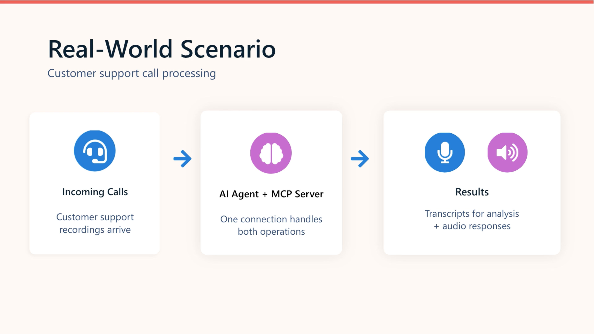
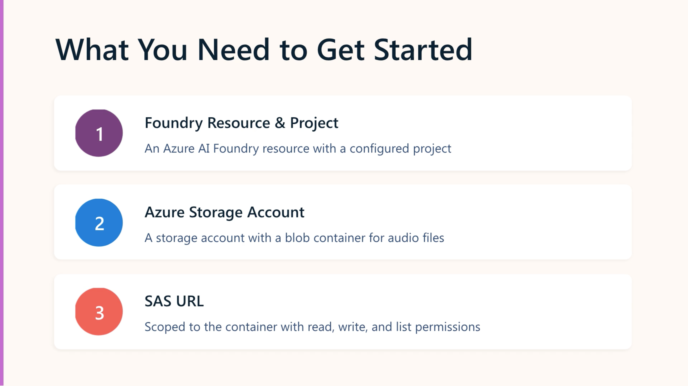

# Develop a Speech Agent with Azure Speech MCP

This module is essentially the **MCP version of the Azure Speech module** you just studied.

> **Azure Speech MCP server → exposes Speech-to-Text and Text-to-Speech as tools → an AI agent discovers and uses those tools dynamically.**



## 1. Azure Speech MCP Server

### What is MCP?

**Model Context Protocol (MCP)** provides a standard way for an AI agent to interact with external tools and services.

```text
Agent / Host
     ↓
   MCP Client
     ↓
Azure Speech MCP Server
     ↓
Azure Speech
```

The important idea is **dynamic tool discovery**.

The agent doesn't need hardcoded logic saying:

> "If the user asks for transcription, call X."

Instead, the MCP server tells the agent which tools are available and what they do. The agent chooses the appropriate tool based on the user's request.

### Speech MCP exposes two core tools

| Tool           | Purpose       |
| -------------- | ------------- |
| **Recognize**  | Speech → Text |
| **Synthesize** | Text → Speech |

**Recognize** supports common formats such as WAV, MP3, OGG, FLAC, MP4, M4A and AAC.

**Synthesize** can use different neural voices and languages and produces audio such as WAV or MP3.



# 2. Azure Blob Storage

This is a particularly important difference from the text MCP module.

Because we're dealing with **audio files**, the Speech MCP server needs **Azure Blob Storage**.

### Speech → Text

```text
Audio file
    ↓
Blob Storage / public URL
    ↓
Speech MCP
    ↓
Text
```

### Text → Speech

```text
Text
 ↓
Speech MCP
 ↓
Audio file
 ↓
Blob Storage
 ↓
Link returned to agent
```

### 🔐 SAS URL (Shared Access Signature)

The MCP server accesses Blob Storage using a **SAS URL**.

A SAS URL is a **temporary, restricted-access link** to an Azure Storage resource. Treat SAS URLs like credentials.

```text
https://mystorage.blob.core.windows.net/audio/file.wav
    ?sv=...         
    &sr=b                         - resource being accessed
    &sp=rl                        - permissions (Read,Add, Create, Write, List)
    &se=2026-09-11T12:00:00Z      - expiry time
    &sig=...                      - Cryptographic signature proving access is authorised
```

**Remember:** Permissions + Scope + Expiry

* Shortest practical expiry
* Minimum required permissions
* Limit to the required container
* Don't embed in source code
* Don't put them in prompts or transcripts
* Rotate credentials if exposed

This is exactly the sort of security detail Microsoft likes to sneak into an exam question. 🔒

---

# 3. Connect Speech MCP to a Foundry Agent

### Setup

You need:

1. Azure subscription
2. Microsoft Foundry resource/project
3. Deployed model for the agent
4. Azure Storage account
5. Blob container
6. Container SAS URL

### In Foundry

```text
Foundry Project
      ↓
Deploy model
      ↓
Create agent
      ↓
Tools
      ↓
Azure Speech in Foundry Tools
      ↓
Configure connection
      ↓
Use in agent
```

Connection requires:

| Setting                     | Value                        |
| --------------------------- | ---------------------------- |
| `foundry-resource-name`     | Your Foundry resource        |
| `Ocp-Apim-Subscription-Key` | Foundry resource/project key |
| `X-Blob-Container-Url`      | Blob container SAS URL       |

---

# 4. The Agent Chooses the Tool

This is probably the **most important concept in the module**.

Suppose the user says:

> "Transcribe this audio file."

The agent:

```text
User request
     ↓
Agent understands intent
     ↓
Discovers available MCP tools
     ↓
Selects Recognize
     ↓
Azure Speech
     ↓
Transcript
```

If they say:

> "Turn this text into speech using a British female voice."

The agent selects **Synthesize** instead.

### No hardcoded routing

You don't need to write:

```python
if request == "transcribe":
    ...
elif request == "synthesize":
    ...
```

The agent uses the **tool descriptions + user intent** to select the appropriate MCP tool.

That's the MCP magic trick. Less plumbing, more delegation.

---

# 5. Customising Speech Through the Prompt

You can specify Speech options using **natural language**.

### Voice

```text
Use the voice en-GB-SoniaNeural.
```

### Language

```text
Recognize this audio as Spanish.
```

### Phrase hints

Useful for specialist terminology:

```text
Use these phrase hints:
Azure, OpenAI, Cognitive Services
```

This can improve transcription accuracy.

### Profanity filtering

You can request:

* `masked`
* `removed`
* `raw`

### Key point

The agent can translate your natural-language request into the appropriate parameters for the Speech tool.

---

# 6. Python Client Application

Once the agent works in the Playground, you can call it from your own application.

### SDKs

```bash
pip install azure-ai-projects azure-identity
```

### Basic architecture

```text
Python application
       ↓
AIProjectClient
       ↓
get_openai_client()
       ↓
Responses API
       ↓
Speech Agent
       ↓
Speech MCP
       ↓
Azure Speech
```

### Key method

```python
response = openai_client.responses.create(
    input=[
        {
            "role": "user",
            "content": user_prompt
        }
    ],
    extra_body={
        "agent_reference": {
            "name": "Speech-Agent",
            "type": "agent_reference"
        }
    }
)
```

Then:

```python
print(response.output_text)
```

### Remember

**`agent_reference` identifies which Foundry agent should handle the request.**

---

# 7. Connecting MCP in Code

You don't have to configure the MCP connection entirely through the Foundry portal.

You can define it programmatically with:

```python
from azure.ai.projects.models import MCPTool
```

Example:

```python
mcp_tool = MCPTool(
    server_label="azure-speech",
    server_url="https://{foundry-resource-name}.cognitiveservices.azure.com/speech/mcp",
    require_approval="always"
)
```

### Important parameter

```text
require_approval
```

Controls whether tool calls require approval.

---

# 🧠 AI-103 Revision Snapshot

> **Azure Speech MCP = Speech capabilities exposed as MCP tools.**
>
> **Recognize:** Speech → Text
> **Synthesize:** Text → Speech
>
> **MCP:** enables dynamic tool discovery and selection.
>
> **Storage:** Azure Blob Storage handles audio files.
>
> **Authentication:** Foundry resource key + Blob SAS URL.
>
> **Agent:** decides which Speech tool to use.
>
> **Python:** `AIProjectClient` → OpenAI client → `responses.create()` → `agent_reference`.
>
> **MCP in code:** `MCPTool`.

---

## ⚠️ Exam points to memorise

| Question                                 | Answer                              |
| ---------------------------------------- | ----------------------------------- |
| What does Speech MCP expose?             | **Speech-to-text + text-to-speech** |
| Why Blob Storage?                        | **Audio input/output**              |
| How does agent choose a tool?            | **Dynamic MCP tool discovery**      |
| Speech → text tool?                      | **Recognize**                       |
| Text → speech tool?                      | **Synthesize**                      |
| Storage authentication?                  | **SAS URL**                         |
| MCP authentication?                      | **Foundry resource key**            |
| Specify voice?                           | **Natural-language prompt**         |
| Improve recognition of specialist terms? | **Phrase hints**                    |
| Control profanity?                       | `masked`, `removed`, `raw`          |
| Python SDK                               | `azure-ai-projects`                 |
| Invoke agent                             | `responses.create()`                |
| Identify agent                           | `agent_reference`                   |
| Define MCP programmatically              | `MCPTool`                           |

### 🔥 The bigger picture

You've now covered **three layers** that Microsoft is likely to distinguish:

```text
1. Azure Speech SDK
   ↓
   SpeechRecognizer / SpeechSynthesizer

2. Azure Speech MCP
   ↓
   Recognize / Synthesize tools
   ↓
   AI Agent dynamically chooses

3. Generative AI Audio
   ↓
   GPT-4o-transcribe / GPT-4o-tts
```

**The key distinction:**

> **SDK = your code directly calls Speech.**
> **MCP = your agent chooses Speech tools.**
> **Generative AI audio = GPT models handle the audio.**
