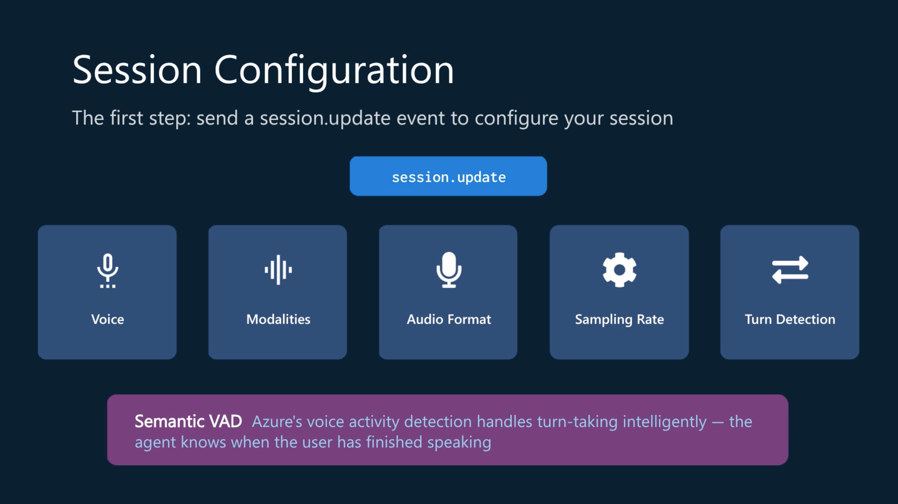

# Develop an Azure Speech Voice Live Agent

> **Voice Live combines audio input, AI reasoning, and audio output into a real-time conversational experience.**

Think **phone-call-style conversation**, rather than:



## 1. Voice Live API

The **Voice Live API** provides real-time, bidirectional communication using **WebSockets**.

### Core capabilities

* 🎤 Speech recognition
* 🗣️ Text-to-speech
* 🔄 Real-time audio streaming
* 🧠 Conversational AI
* 🔊 Noise reduction
* 📢 Echo cancellation
* 👤 Avatar streaming
* Multiple voice options

### Architecture

```text
Microphone
    ↓
WebSocket
    ↓
Voice Live
    ↓
AI model / Foundry Agent
    ↓
Voice Live
    ↓
WebSocket
    ↓
Speaker
```

### Authentication

Two options:

| Method                 | Notes                 |
| ---------------------- | --------------------- |
| **Microsoft Entra ID** | Recommended / keyless |
| **API key**            | Alternative           |

For Entra ID, the application needs appropriate permissions, including the **Cognitive Services User** role.

### Important API events

**Client → Server**

```text
session.update
input_audio_buffer.append
response.create
```

**Server → Client**

```text
session.updated
response.done
conversation.item.created
```

### 🧠 Remember

> **Voice Live = WebSocket + real-time events + bidirectional audio**

---

## 2. Voice Live Python SDK

The Azure AI Voice Live Python SDK provides a higher-level way to work with the API.

Install/use the package:

```python
from azure.ai.voicelive import connect
```

### Important change

The current SDK is **async-only**.

Use:

```python
async
await
```

rather than synchronous APIs.

### Connect

```python
async with connect(
    endpoint=endpoint,
    credential=credential,
    model="gpt-4o"
) as connection:
```

### Authentication

For production:

```python
from azure.identity.aio import DefaultAzureCredential
```

and:

```python
credential = DefaultAzureCredential()
```

Microsoft recommends **Entra ID** rather than embedding API keys in production applications.

---

## Event handling

Your application listens continuously:

```python
async for event in connection:
    ...
```

Important events include:

| Event                               | Meaning                       |
| ----------------------------------- | ----------------------------- |
| `SESSION_UPDATED`                   | Session ready                 |
| `INPUT_AUDIO_BUFFER_SPEECH_STARTED` | User started talking          |
| `RESPONSE_AUDIO_DELTA`              | Audio response chunk received |
| `ERROR`                             | Something went wrong          |

### 🚨 Interruptions

This is an important real-time concept.

If the user starts speaking while the agent is talking:

```text
User speaks
    ↓
Detect interruption
    ↓
STOP agent playback
    ↓
Cancel/interrupt response
    ↓
Listen to user
```

Otherwise you get the wonderfully human experience of an AI **talking over you**.

---

#@ 3. Create a Voice Live Agent

Voice Live can connect directly to a model **or to a Microsoft Foundry Agent**.

### Why use a Foundry Agent?

The agent encapsulates:

* Instructions
* Configuration
* Behaviour
* Business logic
* Conversational flow

So your client application doesn't need to contain all that logic.

```text
Client
  ↓
Voice Live
  ↓
Foundry Agent
  ↓
Model + instructions + tools
```

### Voice configuration

You can configure:

* Language
* Voice
* Speaking rate
* Tone
* VAD - **Voice Activity Detection**
* Noise reduction
* Echo cancellation
* Interim responses
* Avatar

Example voice:

```text
en-US-Ava:DragonHDLatestNeural
```


### VAD - Voice Activity Detection

**Voice Activity Detection** determines:

> "Is the user speaking, and when have they finished?"

Voice Live supports **Azure Semantic VAD**.

This is more intelligent than simply detecting whether audio volume exceeds a threshold.

---

## 🧠 AI-103 Revision Snapshot

Voice Live - **Real-time speech-to-speech conversational AI**
API - **WebSocket + JSON events**
SDK - ```azure.ai.voicelive```
Authentication - **Microsoft Entra ID preferred** > API key also supported
Agent - **Microsoft Foundry Agent + Voice Live**
VAD - **Voice Activity Detection** determines when someone starts/stops speaking.
Audio quality - **Noise reduction + echo cancellation**
Client - Captures microphone → sends audio → receives audio → plays through speaker.
SDK style - **Async-only** → `async` / `await`

---

## ⚠️ Exam traps

| If asked...                    | Remember...                                     |
| ------------------------------ | ----------------------------------------------- |
| Real-time communication?       | **WebSockets**                                  |
| Voice Live API direction?      | **Bidirectional**                               |
| Python SDK?                    | `azure.ai.voicelive`                            |
| Current SDK programming model? | **Async**                                       |
| Preferred authentication?      | **Microsoft Entra ID**                          |
| Detect user speaking?          | **VAD**                                         |
| Intelligent VAD?               | **Azure Semantic VAD**                          |
| Background noise?              | **Noise reduction**                             |
| Speaker feedback?              | **Echo cancellation**                           |
| User interrupts agent?         | **Stop/clear audio playback**                   |
| Foundry Agent advantage?       | Agent logic/configuration separated from client |
| Audio input/output?            | `AudioProcessor`                                |
| Voice/agent orchestration?     | `VoiceAssistant`                                |

---

## 🔥 Where this fits with the modules you've just studied

This is the useful progression:

```text
1. Azure Speech
   └─ SpeechRecognizer / SpeechSynthesizer
        ↓
   Dedicated speech services


2. Speech MCP
   └─ Recognize / Synthesize
        ↓
   Agent dynamically uses Speech tools


3. Generative AI Audio
   └─ GPT-4o-transcribe / GPT-4o-tts
        ↓
   Generative audio models


4. Voice Live
   └─ Real-time bidirectional conversation
        ↓
   Voice + AI + streaming + VAD + interruptions
```
