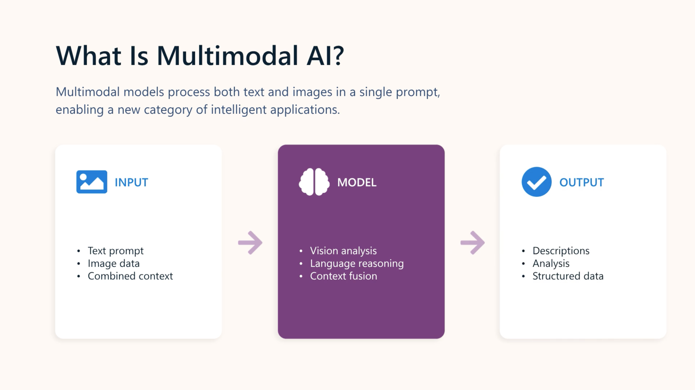

# Develop a vision-enabled generative AI application



## 1. Vision-enabled generative AI

A **multimodal model** can accept more than text as input, including images.

Examples in Microsoft Foundry include:

* `Phi-4-multimodal-instruct`
* `gpt-4.1`
* `gpt-4.1-mini`

Vision models can do more than identify objects. They can **reason about visual information**, such as interpreting charts or assessing damage.

### Key concept

```text
Text + Image
     ↓
Multimodal model
     ↓
Reasoned response
```

---

## 2. Deploy and test a vision-capable model

To process image prompts:

1. Deploy a **multimodal model** in Microsoft Foundry.
2. Open the **Chat playground**.
3. Upload an image.
4. Add a text prompt/question.
5. The model analyses both inputs.

### Exam point

> **Visual input → multimodal model**

Not:

* Embedding model ❌
* Text-only model ❌

---

## 3. Develop a vision-based chat app

A vision chat app uses the same basic approach as a text chat app:

```python
# Read the image data from a local file
image_path = Path("dragon-fruit.jpeg")
image_format = "jpeg"
with open(image_path, "rb") as image_file:
    image_data = base64.b64encode(image_file.read()).decode("utf-8")

data_url = f"data:image/{image_format};base64,{image_data}" # You can also use a web URL

# Send the image data in a prompt to the model
response = client.responses.create(
    model="gpt-4.1",
    input=[
        {"role": "developer", "content": "You are an AI assistant for chefs planning recipes."},
        {"role": "user", "content": [  
            { "type": "input_text", "text": "What desserts could I make with this?"},
            { "type": "input_image", "image_url": data_url}
        ] } 
    ]
)
print(response.output_text)
```

The important difference is that the user's message is **multi-part**.

```text
User message
 ├── Text content
 └── Image content
```

### Responses API

Images can be supplied as:

* A **web URL**
* **Base64-encoded image data**

Example structure:

```python
{
    "role": "user",
    "content": [
        {
            "type": "input_text",
            "text": "What can I make with this?"
        },
        {
            "type": "input_image",
            "image_url": data_url
        }
    ]
}
```

### Important API distinction

**Responses API:**

```python
client.responses.create()
```

Image content types:

```text
input_text
input_image
```

**Chat Completions API:**

```python
client.chat.completions.create()
```

Image content types:

```text
text
image_url
```

---

## 🧠 AI-103 Revision Snapshot

| **Topic**                       | **Remember**                                                 |
| ------------------------------- | ------------------------------------------------------------ |
| **Vision-enabled AI**           | Generative AI that can understand **images + text**          |
| **Model type**                  | **Multimodal model**                                         |
| **Examples**                    | `gpt-4.1`, `gpt-4.1-mini`, `Phi-4-multimodal-instruct`       |
| **Foundry testing**             | Upload image + text prompt in **Chat playground**            |
| **Vision prompt**               | A **multi-part user message** containing text + image        |
| **Image input**                 | Web **URL** or **Base64** encoded data                       |
| **Responses API**               | `client.responses.create()`                                  |
| **Responses image type**        | `input_image`                                                |
| **Chat Completions**            | `client.chat.completions.create()`                           |
| **Chat Completions image type** | `image_url`                                                  |
| **Vision capability**           | Can identify objects **and reason about visual information** |

### 🔑 Exam traps

* **Multimodal** = model can handle different input modalities.
* An image prompt isn't a separate image prompt followed by a text prompt. **Text + image belong in the same multi-part user message.**
* Images can be provided as a **URL or Base64 data**.
* `input_image` → **Responses API**
* `image_url` → **Chat Completions API**

### 🧠 Memory hook

> **Vision = Multimodal + multi-part message: Text + Image → Model → Response**
