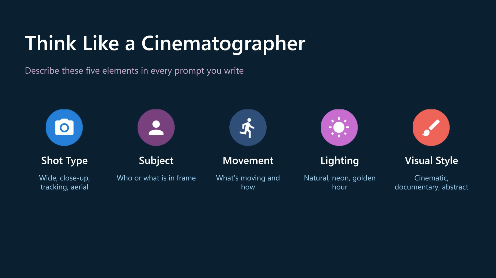

# Generate videos with Microsoft Foundry

## 1. Deploy a video-generation model

The module uses **Sora 2**.

```text
Text / Image / Existing video
          ↓
        Sora 2
          ↓
       Video
```

Sora 2 supports:

* **Text → video**
* **Image → video** - The image resolution must match the target video size (1280x720 or 720x1280)
* **Video remix** - Make targeted adjustments to existing videos without regenerating from scratch
* **Audio generation** - Supports audio generation in output videos
* Multiple resolutions - Portrait: `720x1280`, Landscape: `1280x720`
* Durations: **4, 8, 12 seconds**

## 2. Generate video from a prompt

Video generation is **asynchronous**.

```text
Create job
    ↓
Poll status
    ↓
Completed
    ↓
Download video
```

### Key parameters

| Parameter         | Purpose                         |
| ----------------- | ------------------------------- |
| `prompt`          | Description of the video        |
| `model`           | `sora-2` or `sora-2-pro`        |
| `size`            | `1280x720` or `720x1280`        |
| `seconds`         | `4`, `8`, or `12`               |
| `input_reference` | Reference image for first frame |
| `remix_video_id`  | Existing video to remix         |

### Prompt structure



For movement, describe actions as **beats** rather than vague instructions.

## 3. Reference images

An image can be used to establish the **first frame/composition**.

```text
Reference image
      +
    Prompt
      ↓
    Sora 2
      ↓
    Video
```

Supported formats:

* JPEG
* PNG
* WebP

The reference image must match the target video resolution.

**Important:** reference images containing human faces are currently rejected.

## 4. Remix existing videos

Remixing lets you modify an existing video while preserving its core structure.

```text
Existing video
      +
   New prompt
      ↓
     Remix
      ↓
Modified video
```

Use the existing **video ID** and describe the change you want.

For best results, make the modification **specific and focused**.

## 5. Generate video with Python

The OpenAI Python SDK uses:

```python
client.videos.create()
```

Basic pattern:

```python
video = client.videos.create(
    model="sora-2",
    prompt="...",
    size="1280x720",
    seconds="4"
)
```

Then poll:

```python
video = client.videos.retrieve(video.id)
```

When complete:

```python
content = client.videos.download_content(
    video.id,
    variant="video"
)
```

Then save the result:

```python
content.write_to_file("output.mp4")
```

---

## 6. Video job states

| Status        | Meaning                 |
| ------------- | ----------------------- |
| `queued`      | Waiting to be processed |
| `in_progress` | Video being generated   |
| `completed`   | Ready for download      |
| `failed`      | Generation failed       |
| `cancelled`   | Job cancelled           |

Completed videos are available for download for **24 hours**.

---

## 🧠 AI-103 Revision Snapshot

| **Topic**             | **Remember**                                     |
| --------------------- | ------------------------------------------------ |
| **Video model**       | **Sora 2**                                       |
| **Text → video**      | Prompt → Sora 2 → video                          |
| **Image → video**     | `input_reference`                                |
| **Video remix**       | `remix_video_id` / `videos.remix()`              |
| **Python SDK**        | OpenAI Python SDK                                |
| **Create video**      | `client.videos.create()`                         |
| **Check status**      | `client.videos.retrieve()`                       |
| **Download**          | `client.videos.download_content()`               |
| **Process**           | **Asynchronous**                                 |
| **Job pattern**       | Create → Poll → Download                         |
| **Landscape**         | `1280x720`                                       |
| **Portrait**          | `720x1280`                                       |
| **Duration**          | `4`, `8`, `12` seconds                           |
| **Reference formats** | JPEG, PNG, WebP                                  |
| **Reference image**   | Must match target resolution                     |
| **Remix**             | Modify existing video while preserving structure |
| **Content filtering** | Harmful prompts can be blocked                   |

### 🔑 Exam traps

* Video generation is **asynchronous**, not an immediate response.
* `create()` starts the job. It does **not** mean the video is ready.
* Use `retrieve()` to check the job status.
* Download only when status = `completed`.
* `input_reference` = image used as a visual starting point.
* `remix()` = modify an existing video.
* Reference image resolution must match the target video.
* **Sora 2 supports both generation and remixing.**

### 🧠 Memory hook

> **Sora = Create → Check → Collect**
> `videos.create()` → `videos.retrieve()` → `videos.download_content()`
