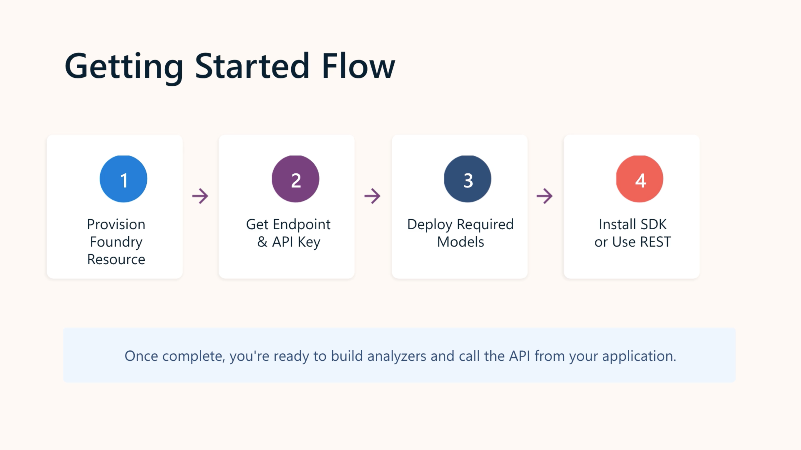
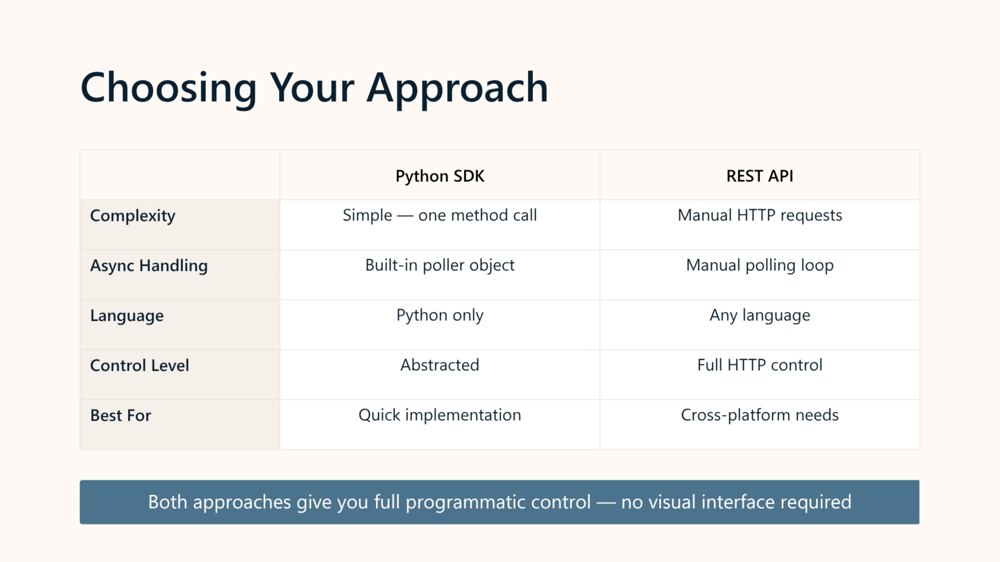

# Create an Azure Content Understanding client application

## Module goal

Use the **Azure Content Understanding API** to:

1. Create a custom analyzer.
2. Submit content to the analyzer.
3. Retrieve structured analysis results.

```text
Content
   ↓
Analyzer
   ↓
Analysis
   ↓
Structured results
```



## 1. Prepare the API

You need:

- A **Microsoft Foundry resource/project**
- Foundry **endpoint**
- API key, or Microsoft Entra ID authentication
- Python 3.9+

Install:

```python
pip install azure-ai-contentunderstanding
```

### Required model deployments

Content Understanding requires:

```text
GPT-4.1
GPT-4.1-mini
text-embedding-3-large
```

## 2. Create an analyzer

An **analyzer** is defined by a **schema** describing the fields you want extracted or generated.

Example:

```python
{
    "baseAnalyzerId": "prebuilt-document",
    "fieldSchema": {
        "fields": {
            "ContactName": {
                "type": "string",
                "method": "extract"
            },
            "EmailAddress": {
                "type": "string",
                "method": "extract"
            }
        }
    }
}
```

### Key concepts

| Property | Purpose |
| --- | --- |
| `baseAnalyzerId` | Starting analyzer/template |
| `fieldSchema` | Defines fields |
| `type` | Data type of field |
| `method` | `extract`, `classify`, or `generate` |
| `models` | Models used by analyzer |
| `config` | Analyzer configuration |

### Python

```python
ContentUnderstandingClient
```

Create analyzer:

```python
client.begin_create_analyzer()
```

Because creation is asynchronous:

```python
poller = client.begin_create_analyzer(...)
result = poller.result()
```

## 3. Analyze content

Content can be supplied as:

- A publicly accessible **URL**
- **Binary file data**

Supported examples include:

```text
PDF
PNG
MP3
MP4
```



### Python

```python
client.begin_analyze()
```

Example:

```python
poller = client.begin_analyze(
    analyzer_id="business_card_analyser",
    inputs=[
        AnalysisInput(
            url="https://host.com/business-card.png"
        )
    ]
)

result = poller.result()
```

### Important

Analysis is **asynchronous**.

```text
begin_analyze()
      ↓
   Poller
      ↓
poller.result()
      ↓
   Results
```

The SDK's poller handles the polling for you.

## 4. REST API

### Create analyzer

```text
PUT
/contentunderstanding/analyzers/{analyzer}
```

### Analyze content

```text
POST
/contentunderstanding/analyzers/{analyzer}:analyze
```

### Analyze binary content

```text
analyzeBinary
```

### Retrieve results

```text
GET
/contentunderstanding/analyzerResults/{operation-id}
```

### REST pattern

```text
PUT analyzer
     ↓
Operation-Location
     ↓
GET status
     ↓
POST analyze
     ↓
Operation ID
     ↓
GET analyzerResults
     ↓
Succeeded
```

---

## 5. Process the results

Results can contain:

```text
fields
markdown
metadata
OCR/layout information
confidence
source/grounding
```

For example:

```python
content.fields
```

Individual fields contain their value and metadata such as confidence.

```text
Field
 ├── type
 ├── value
 ├── confidence
 └── source
```

### Grounding

`source` identifies **where in the original content the extracted value came from**.

This is useful for verifying extracted information.

---

# 🧠 AI-103 Revision Snapshot

| **Topic** | **Remember** |
|---|---|
| **SDK package** | `azure-ai-contentunderstanding` |
| **Main client** | `ContentUnderstandingClient` |
| **Create analyzer** | `begin_create_analyzer()` |
| **Analyze content** | `begin_analyze()` |
| **Get async result** | `poller.result()` |
| **Analyzer definition** | JSON schema |
| **Base analyzer** | `baseAnalyzerId` |
| **Fields** | `fieldSchema.fields` |
| **Field methods** | `extract`, `classify`, `generate` |
| **URL input** | `analyze` |
| **Binary input** | `analyzeBinary` |
| **REST create** | `PUT` |
| **REST analyze** | `POST` |
| **REST results** | `GET analyzerResults` |
| **Analysis** | Asynchronous |
| **Results** | Fields + markdown + metadata + confidence + source |
| **Grounding** | `source` shows where extracted data came from |
| **Required models** | `GPT-4.1`, `GPT-4.1-mini`, `text-embedding-3-large` |

### 🔑 Exam traps

- **Analyzer creation is asynchronous** → `begin_create_analyzer()` + poller.
- **Content analysis is asynchronous** → `begin_analyze()` + poller.
- URL content → `analyze`
- Binary content → `analyzeBinary`
- **Schema defines the fields**, not the analyzer itself in isolation.
- `extract` = find existing information.
- `classify` = assign a category.
- `generate` = produce information based on analysis.
- **Confidence** = how reliable the result is.
- **Source/grounding** = where the result came from.
- Content Understanding requires the specified **model deployments** before use.

### 🧠 Memory hook

> **Create → Analyze → Poll → Extract**  
> `begin_create_analyzer()` → `begin_analyze()` → `poller.result()` → `content.fields`