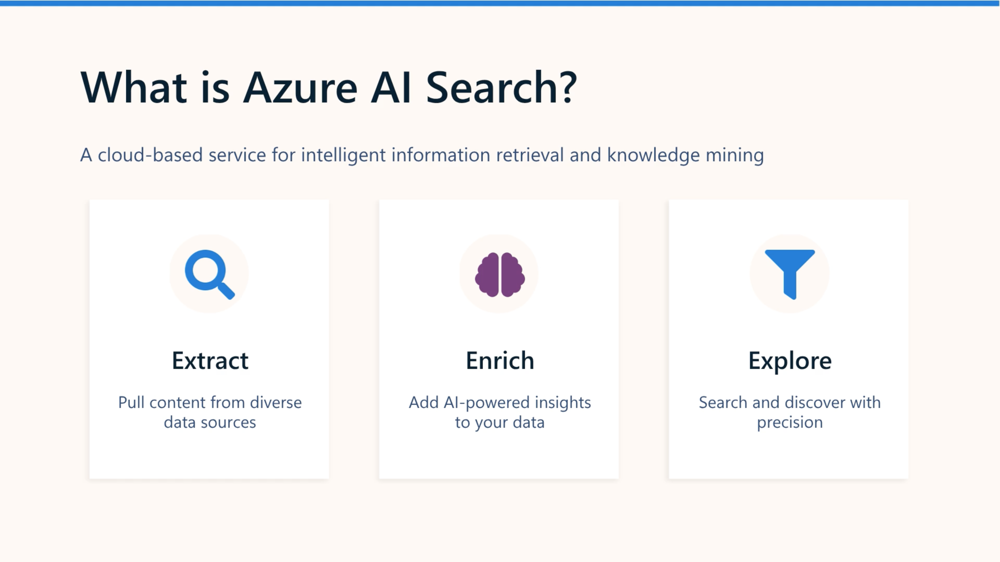
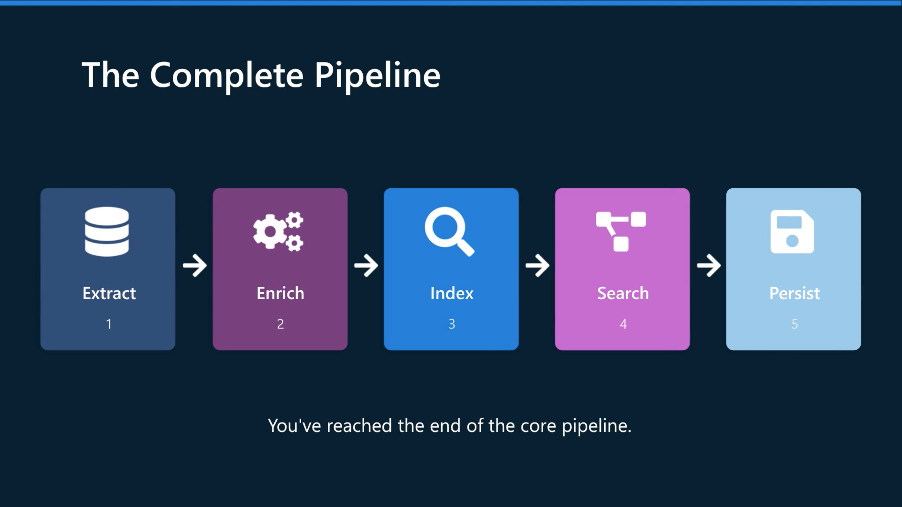

# Create a knowledge mining solution with Azure AI Search

## Module goal

Use **Azure AI Search** to take raw data, **extract and enrich it with AI**, make it searchable, and optionally persist the enriched information in a **knowledge store**.

```text
Data source
    ↓
Indexer
    ↓
AI enrichment / skillset
    ↓
Search index
    ↓
Search / RAG / analytics
    ↓
Knowledge store (optional)
```



## 1. What is Azure AI Search?

Azure AI Search is a cloud service for:

- Indexing data from different sources
- Enriching data with AI skills
- Searching the resulting index
- Supporting **RAG**
- Creating knowledge-mining solutions

### Key distinction

**The index is not your original data.**

It contains the **searchable representation** of your data, including fields extracted or generated during enrichment.

## 2. Extract data with an Indexer

The **indexer** is the engine that moves data from a source into an index.

```text
Data source - connect to blob, SQL, Cosmos DB
    ↓
Indexer
    ↓
Document cracking - Extract text and metadata
    ↓
Enrichment pipeline - Apply AI skills to content
    ↓
Index - Map fields into the searchable JSON
```

### Data sources

Examples:

- Azure Blob Storage
- Databases
- Other supported stores

The indexer:

1. Reads the source
2. Extracts content/metadata
3. Runs the skillset
4. Builds a hierarchical JSON document
5. Maps fields into the search index

### Document cracking

**Document cracking** extracts the content from source files so it can be processed.

For example:

```text
PDF
 ↓
Text + metadata + images
```

Images can then be passed to additional AI skills.

## 3. Enrich data with AI Skills

A **skillset** is a collection of AI skills applied during indexing. Built-in skills:

```text
Indexer
   ↓
Skillset
 ┌────────────────────────┐
 │ Language               │
 │ OCR                    │
 │ Entities               │
 │ Key phrases            │
 │ Translation            │
 │ PII  detection/removal │
 │ OCR.                   │
 │ Image captions         │
 │ Image tags             │
 └────────────────────────┘
   ↓
Enriched document
```

### Custom skills

You can create your own skill, commonly using an **Azure Function**.

A custom skill can call another service, for example:

```text
Azure AI Search
      ↓
Custom skill
      ↓
Document Intelligence
      ↓
Extract invoice fields
      ↓
Back into enrichment pipeline
```

This is an important connection between **AI Search and Document Intelligence**.

## 4. Search an index

The index contains JSON documents with fields.

Fields can be configured as:

| Attribute | Purpose |
| --- | --- |
| **key** | Unique identifier |
| **searchable** | Full-text search |
| **filterable** | Filter results |
| **sortable** | Sort results |
| **facetable** | Create filtering categories |
| **retrievable** | Return field in results |

### Search types

Azure AI Search supports:

**Simple query syntax** → straightforward searches.

**Full Lucene query syntax** → more advanced queries, including complex filtering and regular expressions.

### Important query parameters

```text
search
queryType
searchFields
select
searchMode
$filter
$orderby
facet
```

## 5. Filtering, sorting and facets

### Filter

Restrict results based on field values.

```text
Find:
London

WHERE:
author = Reviewer
```

Uses **OData `$filter`** with full query syntax.

### Facet

Provides a list of values users can select to refine results.

```text
Author
 ├── Reviewer
 ├── Editor
 └── Administrator
```

Think:

> **Facet = user-friendly filtering categories**

### Sort

Uses:

```text
$orderby
```

Example:

```text
last_modified desc
```

## 6. Knowledge Store

The **knowledge store** persists the enriched information produced by the enrichment pipeline.

It can store projections as:

- **Objects** → JSON
- **Tables** → relational-style data
- **Files** → images

```text
                Enrichment
                    ↓
              ┌─────┴─────┐
              ↓           ↓
           Search      Knowledge
            Index        Store
                         ↓
                 JSON / Tables / Images
```

### Why?

The search index is primarily for **search**.

The knowledge store lets you reuse the enriched data for:

- Analytics
- Reporting
- ETL
- Data processing
- Other applications



---

## 🧠 AI-103 Revision Snapshot

| **Topic** | **Remember** |
| --- | --- |
| **Azure AI Search** | Index, enrich and search data |
| **Knowledge mining** | Extract + enrich data to discover useful information |
| **Indexer** | Moves/extracts data into the search index |
| **Document cracking** | Extracts content from source documents |
| **Skillset** | Collection of AI enrichment skills |
| **Built-in skills** | OCR, language, entities, key phrases, translation, PII, captions |
| **Custom skill** | Your own processing logic, often Azure Function |
| **Index** | Searchable JSON documents |
| **Searchable** | Full-text search |
| **Filterable** | Filter by field |
| **Sortable** | Sort results |
| **Facetable** | User-facing filtering categories |
| **Retrievable** | Return field in search results |
| **Simple query** | Basic search syntax |
| **Full query** | Lucene syntax for advanced queries |
| **`$filter`** | OData filtering |
| **`$orderby`** | Sorting |
| **Knowledge store** | Persist enriched data |
| **Knowledge store projections** | Objects, tables, images |
| **RAG** | AI Search can provide grounding data for generative AI |

### 🔑 Exam traps

- **Indexer ≠ index**
  - Indexer = process that creates/updates the index.
  - Index = searchable data.

- **Skillset ≠ indexer**
  - Indexer orchestrates the pipeline.
  - Skillset defines the enrichment operations.

- **Knowledge store ≠ search index**
  - Index → searching.
  - Knowledge store → reusing enriched data for analytics/integration.

- **Filterable ≠ searchable**
  - Searchable → text search.
  - Filterable → exact/structured filtering.

- **Facetable** is for creating categories users can use to narrow results.

### 🧠 Memory hook

> **SOURCE → INDEXER → SKILLSET → INDEX → SEARCH**  
> **↘ KNOWLEDGE STORE**

And the really important AI-103 connection:

> **AI Search = the pipeline/orchestration layer for making data searchable and enriched.**  
> **Document Intelligence = one of the specialist services you can call from that pipeline via a custom skill.**
